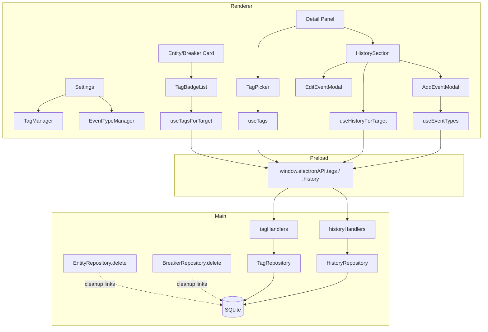

# Map My Panel — Tags & History Brownfield Enhancement Architecture

This document outlines the architectural approach for enhancing **Map My Panel** with two new, related capabilities: a **reusable Tag system** and a **unified History Event system**, both attachable across panels, breakers, and entities.

**Relationship to Existing Architecture:**
This document supplements the existing `docs/architecture.md` by defining how the new tag/history components integrate with the current Electron + React + better-sqlite3 system. Where new patterns are introduced (polymorphic targets, nullable-property scoping), this doc establishes the convention so future work stays consistent.

---

## 1. Introduction

### Existing Project Analysis

- **Primary Purpose:** Desktop app for mapping/documenting a home's electrical breaker panel — panels → breakers → entities (outlets, switches, etc.), organized under properties.
- **Current Tech Stack:** Electron + electron-vite, React + TypeScript, TanStack React Query, better-sqlite3 (synchronous SQLite), Tailwind CSS. IPC via a typed `window.electronAPI` preload bridge.
- **Architecture Style:** Layered — **IPC handlers** (`src/main/ipc/*`) → **Repositories** (`src/main/db/repositories/*`) → **SQLite**. Renderer uses React Query hooks keyed by IDs.
- **Data Model Hierarchy:** `properties` → `panels` → `breakers` → `entities`. Entities hold `breaker_ids` as a JSON array (migration 006). Custom entity types stored per-property as a JSON array.
- **Migrations:** Sequential, idempotent, numbered, tracked in a `migrations` table. **Next migration is 009.** Each is purely additive or does the SQLite table-recreate dance for constraint changes.

### Identified Constraints

- **CRITICAL — No DB resets.** Real production data exists and must not be lost. **All new migrations must be purely additive** (new tables only — no table recreations that risk data).
- **No ORM.** Hand-written SQL in repositories. New repos must match this style.
- **No Prettier/ESLint config.** House style is single-quotes, no semicolons.
- **SQLite FK limitation:** polymorphic `(target_type, target_id)` columns can't have a real foreign key — referential integrity enforced in the repository layer + explicit cleanup on parent delete.
- **React Query discipline:** new hooks follow the IDs-in-state / query-for-data pattern.

### Change Log

| Change | Date | Version | Description | Author |
|--------|------|---------|-------------|--------|
| Initial draft | 2026-06-22 | 0.1 | Tags + unified History Event architecture | Winston (Architect) |

---

## 2. Enhancement Scope and Integration Strategy

### Enhancement Overview

- **Enhancement Type:** Two new feature subsystems (Tags, History Events) sharing a polymorphic-target pattern.
- **Scope:** New tables, repositories, IPC namespaces, React Query hooks, and UI integration into existing cards/detail panels + a new Settings management area. **No changes to existing tables.**
- **Integration Impact:** Moderate. Additive at the data layer (zero risk to existing data); touches several existing UI surfaces for display + entry points.

### Integration Approach

- **Code Integration Strategy:** Mirror the existing layered pattern exactly. New `TagRepository` and `HistoryRepository` alongside `EntityRepository`/`BreakerRepository`. New `tagHandlers.ts` / `historyHandlers.ts` alongside existing IPC handlers. New `useTags` / `useHistory` hooks alongside `useEntities`/`useBreakers`.
- **Database Integration:** Additive-only migrations **009 (tags)** and **010 (history + event types)**. New tables reference existing tables via real FKs only on non-polymorphic columns (e.g. `property_id → properties`). Polymorphic links (`target_type`, `target_id`) carry no FK; integrity enforced in repo + delete-cleanup.
- **API Integration:** New `electronAPI.tags.*` and `electronAPI.history.*` namespaces in the preload bridge, following the exact method-naming style of `electronAPI.entities.*`.
- **UI Integration:**
  - **Tags:** badges on entity/breaker cards; condense-to-icon with hover popover when crowded; a tag picker in detail panels; tag management in Settings.
  - **History:** a "History" section in the breaker/entity/panel detail views; an "Add Event" flow (single + bulk); event-type management in Settings (mirrors custom entity types).

### Compatibility Requirements

- **Existing API Compatibility:** No existing IPC method signatures change. Purely additive surface.
- **Database Schema Compatibility:** No existing tables/columns modified. Migrations 001–008 untouched. New rows isolated in new tables.
- **UI/UX Consistency:** Reuse existing patterns — theme-aware semantic badge colors, existing modal/drawer conventions (incl. the scrim + Escape behavior), and the Settings management pattern used for custom entity types.
- **Performance Impact:** Negligible. Indexed lookups on `(target_type, target_id)`. Per-card tag lookups batchable via a single "tags for these targets" query if profiling demands it.

---

## 3. Data Models and Schema Changes

### Core Pattern: Polymorphic Targets

Both tags and history events attach to a layer via a `(target_type, target_id)` pair:

- `target_type` ∈ `'property' | 'panel' | 'breaker' | 'entity'`
- `target_id` = the id of that row
- `'property'` exists so a history event can stand alone (not tied to any panel/breaker/entity) — e.g. a utility-company incident note about the whole-house meter. A `CreateHistoryEventInput` with no `targets` auto-links to its `property_id`.

SQLite can't enforce a foreign key on a polymorphic column, so referential integrity is enforced in the repository layer, and orphan cleanup runs when a parent panel/breaker/entity is deleted (see Component Architecture).

### Core Pattern: Property Scoping with Global Opt-In

`tags` and `event_types` carry a **nullable `property_id`**:

- `property_id = <id>` → scoped to that property (the default).
- `property_id = NULL` → **global**, shared across all properties (user opts in at creation time).

Lookups for a property return `WHERE property_id = ? OR property_id IS NULL`. New properties are seeded with a set of default tags + event types (created as property-scoped rows, so the user can edit/delete them freely without affecting other properties).

### Migration 009 — Tags

```sql
CREATE TABLE tags (
  id          TEXT PRIMARY KEY,
  property_id TEXT,                   -- NULL = global/shared across properties
  name        TEXT NOT NULL,
  color       TEXT,                   -- semantic/theme-aware badge color key
  icon        TEXT,                   -- emoji/icon shown when condensed (property of the tag)
  condense    INTEGER NOT NULL DEFAULT 0 CHECK (condense IN (0, 1)),
  created_at  DATETIME DEFAULT CURRENT_TIMESTAMP,
  updated_at  DATETIME DEFAULT CURRENT_TIMESTAMP,
  FOREIGN KEY (property_id) REFERENCES properties(id) ON DELETE CASCADE
);

CREATE TABLE tag_links (
  id          TEXT PRIMARY KEY,
  tag_id      TEXT NOT NULL,
  target_type TEXT NOT NULL CHECK (target_type IN ('panel', 'breaker', 'entity')),
  target_id   TEXT NOT NULL,
  created_at  DATETIME DEFAULT CURRENT_TIMESTAMP,
  FOREIGN KEY (tag_id) REFERENCES tags(id) ON DELETE CASCADE,
  UNIQUE (tag_id, target_type, target_id)
);

CREATE INDEX idx_tags_property ON tags(property_id);
CREATE INDEX idx_tag_links_target ON tag_links(target_type, target_id);
CREATE INDEX idx_tag_links_tag ON tag_links(tag_id);

-- Name uniqueness: case-insensitive, per scope. Two partial unique indexes because
-- SQLite treats every NULL property_id as distinct in a normal UNIQUE constraint.
CREATE UNIQUE INDEX idx_tags_name_scoped ON tags(property_id, name COLLATE NOCASE)
  WHERE property_id IS NOT NULL;
CREATE UNIQUE INDEX idx_tags_name_global ON tags(name COLLATE NOCASE)
  WHERE property_id IS NULL;
```

### Migration 010 — History Events + Event Types

```sql
CREATE TABLE event_types (
  id          TEXT PRIMARY KEY,
  property_id TEXT,                   -- NULL = global/shared across properties
  name        TEXT NOT NULL,         -- 'Inspection', 'Outlet Change', 'Breaker Added', 'Meter Install', 'Power Outage'
  created_at  DATETIME DEFAULT CURRENT_TIMESTAMP,
  FOREIGN KEY (property_id) REFERENCES properties(id) ON DELETE CASCADE
);

CREATE TABLE history_events (
  id            TEXT PRIMARY KEY,
  property_id   TEXT NOT NULL,        -- events always belong to a concrete property
  event_type_id TEXT,                 -- nullable: deleting a type doesn't destroy history
  title         TEXT,                 -- short summary, optional
  notes         TEXT,                 -- free text
  occurred_on   TEXT NOT NULL,        -- editable maintenance/occurrence date (YYYY-MM-DD)
  logged_at     DATETIME DEFAULT CURRENT_TIMESTAMP,  -- when recorded (immutable)
  tag_id        TEXT,                 -- optional bridge: a tag attached during/after logging (editable)
  created_at    DATETIME DEFAULT CURRENT_TIMESTAMP,
  updated_at    DATETIME DEFAULT CURRENT_TIMESTAMP,
  FOREIGN KEY (property_id)   REFERENCES properties(id)  ON DELETE CASCADE,
  FOREIGN KEY (event_type_id) REFERENCES event_types(id) ON DELETE SET NULL,
  FOREIGN KEY (tag_id)        REFERENCES tags(id)        ON DELETE SET NULL
);

CREATE TABLE event_links (
  id          TEXT PRIMARY KEY,
  event_id    TEXT NOT NULL,
  target_type TEXT NOT NULL CHECK (target_type IN ('panel', 'breaker', 'entity')),
  target_id   TEXT NOT NULL,
  created_at  DATETIME DEFAULT CURRENT_TIMESTAMP,
  FOREIGN KEY (event_id) REFERENCES history_events(id) ON DELETE CASCADE,
  UNIQUE (event_id, target_type, target_id)
);

CREATE INDEX idx_event_types_property ON event_types(property_id);
CREATE INDEX idx_history_events_property ON history_events(property_id);
CREATE INDEX idx_history_events_occurred ON history_events(occurred_on);
CREATE INDEX idx_event_links_target ON event_links(target_type, target_id);
CREATE INDEX idx_event_links_event ON event_links(event_id);

CREATE UNIQUE INDEX idx_event_types_name_scoped ON event_types(property_id, name COLLATE NOCASE)
  WHERE property_id IS NOT NULL;
CREATE UNIQUE INDEX idx_event_types_name_global ON event_types(name COLLATE NOCASE)
  WHERE property_id IS NULL;
```

### Default Seed Data

When a property is created, seed property-scoped defaults (editable/deletable per property):

- **Default tags:** `No Ground Wire`, `Grounded to Box (Self-Grounding)`, `Reverse Polarity`, `GFCI Protected`, `AFCI Protected`
- **Default event types:** `Inspection`, `Outlet Change`, `Switch Change`, `Fixture Change`, `Breaker Added`, `Breaker Removed`, `Meter Install`, `Power Outage`, `Repair`, `Other`

Backfill for the existing property happens inside migration 010 (insert defaults for every existing `properties` row that has none).

### Schema Integration Strategy

- **New Tables:** `tags`, `tag_links` (009); `event_types`, `history_events`, `event_links` (010)
- **Modified Tables:** none
- **New Indexes:** as listed above (target lookups, property scoping, occurred-on sort, name uniqueness)
- **Migration Strategy:** additive-only, sequential 009 then 010, idempotent guard via existing `migrations` table

**Backward Compatibility:**
- Existing tables/columns are untouched — all current queries continue to work unchanged.
- The app functions identically for any panel that has zero tags/events (empty result sets render as "no tags" / "no history").

---

## 4. Component Architecture

New components mirror the existing layered structure exactly: **IPC handler → Repository → SQLite** on the main side, **React Query hook → component** on the renderer side.

### Main process (Node side)

#### `TagRepository` (`src/main/db/repositories/TagRepository.ts`)
- **Responsibility:** CRUD for tags + tag_links; scope-aware lookups (`property OR global`).
- **Key methods:** `create`, `update`, `delete`, `listForProperty(propertyId)`, `listForTarget(targetType, targetId)`, `attach(tagId, targetType, targetId)`, `detach(tagId, targetType, targetId)`, `listTargetsForTag(tagId)`.
- **Integration:** reads `properties` for scoping; never touches existing tables' structure.

#### `HistoryRepository` (`src/main/db/repositories/HistoryRepository.ts`)
- **Responsibility:** CRUD for history_events + event_links + event_types; the bulk-add and link-editing logic.
- **Key methods:** `createEvent(input, targets[])` (one event, many links — the bulk case), `updateEvent`, `deleteEvent`, `addTargets(eventId, targets[])`, `removeTarget(eventId, targetType, targetId)` (fix a misclick), `setTag(eventId, tagId|null)`, `listForTarget(targetType, targetId)`, `listEventTypes(propertyId)`, `createEventType`, `updateEventType`, `deleteEventType`.
- **Integration:** all multi-row writes wrapped in a single better-sqlite3 transaction (synchronous — matches existing repos).

#### Orphan cleanup on parent delete
Because polymorphic links have no FK, deleting a panel/breaker/entity must clean up its links. Two options, decided in this doc:
- **Chosen:** add explicit cleanup calls in the existing `EntityRepository.delete` / `BreakerRepository.delete` / panel delete paths — delete from `tag_links` and `event_links` where `target_type/target_id` match. A history_event left with zero links is also pruned (or kept as an orphan — see open question).
- **Rejected:** SQLite triggers — harder to discover/maintain, and the team's pattern is explicit repo logic, not triggers.

#### IPC handlers
- `tagHandlers.ts` and `historyHandlers.ts` registered in the main process alongside `entityHandlers`/`breakerHandlers`, exposing each repo method over `ipcMain.handle`.

### Preload bridge (`src/preload/index.ts`)
- New `electronAPI.tags.*` and `electronAPI.history.*` namespaces, method names matching the repo methods, following the exact style of `electronAPI.entities.*`.

### Renderer (React side)
- **Hooks:** `useTags(propertyId)`, `useTagsForTarget(targetType, targetId)`, `useHistoryForTarget(targetType, targetId)`, `useEventTypes(propertyId)` — all React Query, keyed by IDs, invalidated on mutation (per project CLAUDE.md pattern).
- **Components:**
  - `TagBadge` / `TagBadgeList` — renders badges; collapses `condense`-flagged tags into icons with a hover popover when the list overflows.
  - `TagPicker` — attach/detach/create tags in a detail panel.
  - `HistorySection` — the timeline list shown in entity/breaker/panel detail views.
  - `AddEventModal` — single + bulk add, with editable `occurred_on`, event-type selector, optional tag attach, and a multi-target picker for bulk.
  - `EditEventModal` — edit event fields + add/remove targets (misclick fix) + change tag.
  - Settings additions: `TagManager` and `EventTypeManager` (mirror the existing custom-entity-type management UI).

### Component Interaction Diagram



### Resolved Decisions (YOLO pass)

- **One tag per history event** (single nullable `tag_id`). Revisit with an `event_tag_links` table only if multi-tag demand appears.
- **No truly-orphan events.** Every `history_event` keeps ≥1 link. Removing the last link is blocked at the repo layer; to drop an event entirely, delete the event (which cascades its links). Panel-level events (outages, meter installs) simply link to the panel.
- **Explicit cleanup** in existing `EntityRepository.delete` / `BreakerRepository.delete` / panel-delete paths removes matching `tag_links` and `event_links`; any event left with zero links in the same transaction is deleted.

---

## 5. Source Tree

### New files

```
src/
├── main/
│   ├── db/
│   │   ├── database.ts                      # + migrations 009, 010 (edit existing)
│   │   └── repositories/
│   │       ├── TagRepository.ts             # NEW
│   │       └── HistoryRepository.ts         # NEW
│   └── ipc/
│       ├── tagHandlers.ts                   # NEW
│       └── historyHandlers.ts               # NEW
├── preload/
│   └── index.ts                             # + tags.* / history.* namespaces (edit existing)
├── shared/
│   └── types/
│       └── index.ts                         # + Tag, TagLink, HistoryEvent, EventType, target types (edit existing)
└── renderer/
    ├── hooks/
    │   ├── useTags.ts                        # NEW
    │   └── useHistory.ts                     # NEW
    ├── lib/
    │   └── queryKeys.ts                      # + tag/history query keys (edit existing)
    └── components/
        ├── tags/
        │   ├── TagBadge.tsx                  # NEW
        │   ├── TagBadgeList.tsx              # NEW
        │   └── TagPicker.tsx                 # NEW
        ├── history/
        │   ├── HistorySection.tsx            # NEW
        │   ├── AddEventModal.tsx             # NEW
        │   └── EditEventModal.tsx            # NEW
        └── settings/
            ├── TagManager.tsx                # NEW
            └── EventTypeManager.tsx          # NEW
```

### Files modified (additive)

- `src/main/db/database.ts` — append migrations 009 & 010
- `src/main/db/repositories/EntityRepository.ts`, `BreakerRepository.ts` — add link cleanup in `delete`
- `src/main/index.ts` (or wherever handlers register) — register `tagHandlers` / `historyHandlers`
- `src/preload/index.ts` — add namespaces
- `src/shared/types/index.ts` — add types
- `src/renderer/lib/queryKeys.ts` — add keys
- Existing card + detail components — mount `TagBadgeList` / `HistorySection`
- `SettingsView.tsx` — mount `TagManager` / `EventTypeManager`

### Integration Guidelines

- **File Naming:** match existing (PascalCase components, camelCase hooks/handlers, `*Repository.ts`).
- **Folder Organization:** new `tags/` and `history/` folders under `components/`, mirroring `entities/`.
- **Import/Export Patterns:** named exports, `@shared/types` alias for shared types (already in use).
- **Style:** single quotes, no semicolons (no formatter configured — do not run Prettier).

---

## 6. Coding Standards & Critical Integration Rules

- **Code Style:** single-quote / no-semicolon TS. Do **not** introduce Prettier/ESLint configs as part of this work.
- **Hooks discipline:** all hooks before any conditional return; use `enabled: !!id`; store IDs in state, query for data; never copy server state into React state (per project CLAUDE.md).
- **Database:** additive migrations only. **Never reset the DB** — real production data exists. Wrap multi-row writes in `db.transaction(...)`.
- **Referential integrity:** polymorphic links validated + cleaned in the repo layer, since SQLite can't FK them.
- **Error handling / logging:** match existing IPC handler conventions (`console.log` migration notices, thrown errors surfaced to renderer via the existing handle pattern).

---

## 7. Testing Strategy

- **Existing framework:** match whatever `docs/testing.md` specifies; add unit coverage for the two new repositories (scope lookups, bulk create transaction, link add/remove, orphan-prevention, delete cleanup).
- **Regression:** verify existing entity/breaker/panel delete still works *and* now cleans up links. Verify a panel with zero tags/events renders unchanged.
- **Manual:** the son's-room bulk-self-grounding scenario end to end (create event across 4 outlets, edit date once, remove a misclicked outlet, attach a tag, confirm badge + condensed icon + popover render).

---

## 8. Next Steps

### Story Manager Handoff

> Build the **Tags & History** enhancement per `docs/architecture-tags-and-history.md`. Sequence: **Tags first** (migration 009, TagRepository, IPC, hooks, TagBadge/TagPicker, TagManager settings) as Epic 1; **History second** (migration 010, HistoryRepository, AddEvent/EditEvent with bulk + misclick-fix, HistorySection, EventTypeManager) as Epic 2. Critical constraints: additive-only migrations (production data exists — no resets), polymorphic links cleaned in repo layer, house style is single-quote/no-semicolon. First story: migration 009 + Tag types + TagRepository with tests.

### Developer Handoff

> Start with migration 009 and the shared types (already drafted below in implementation notes). Follow the existing IPC→Repository→SQLite + React Query (IDs-in-state) patterns. Verify each migration runs idempotently against a copy of real data before shipping. Do not run Prettier (no config; it reformats the whole file).

