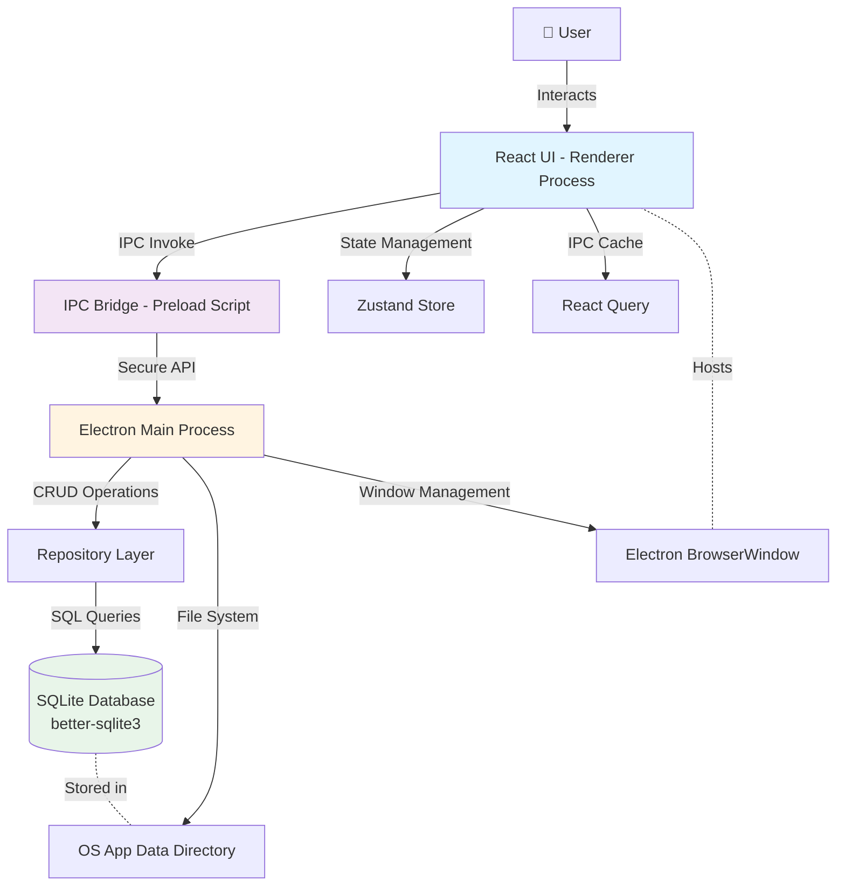
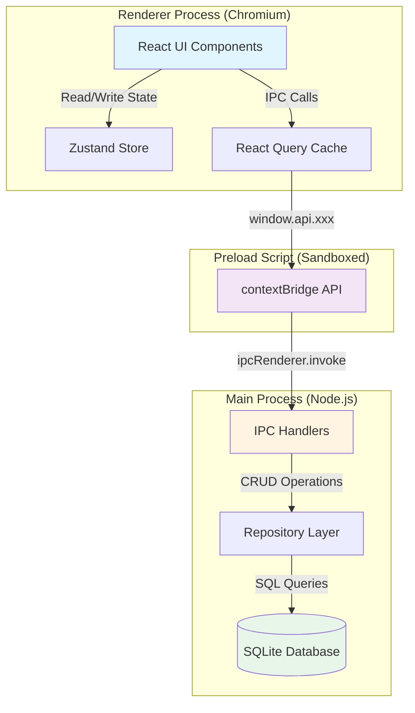
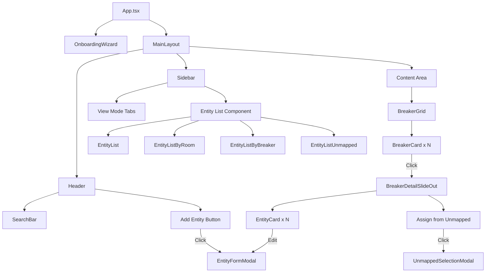
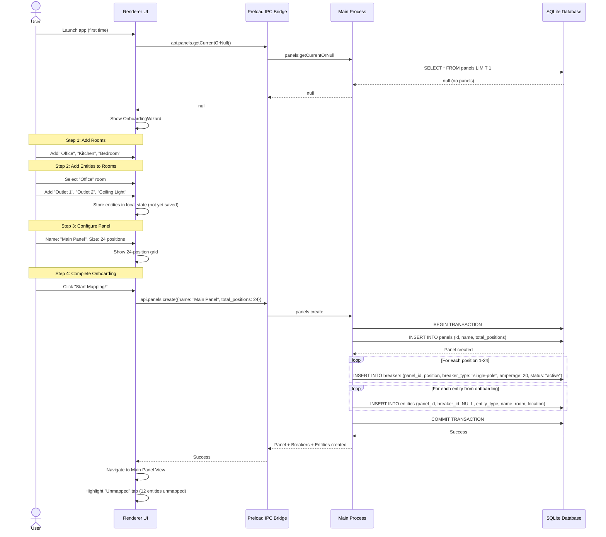
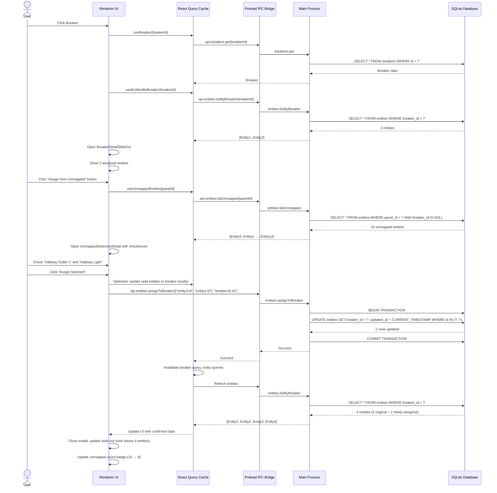
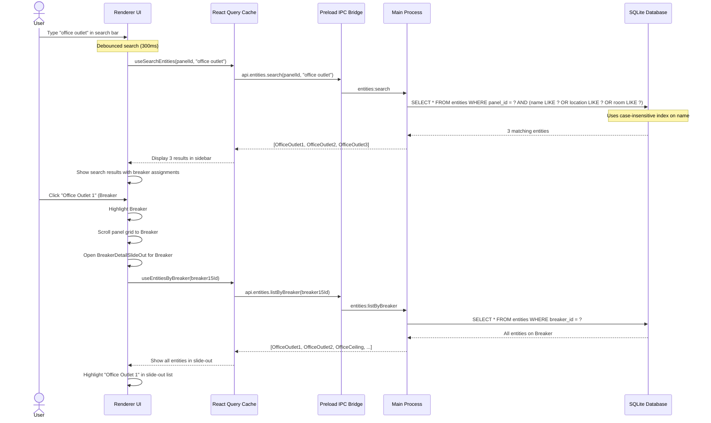
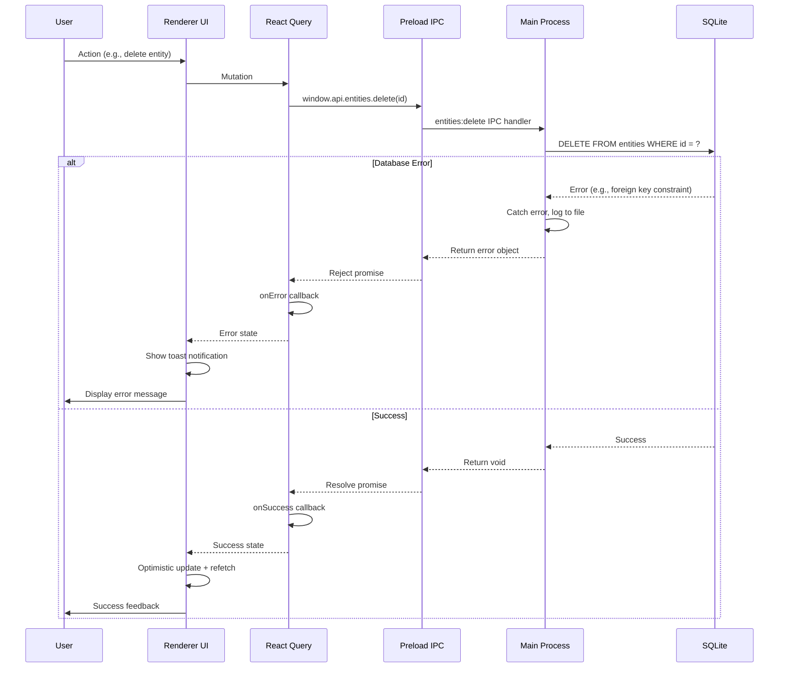

# Map My Panel Architecture Document

**Version:** 1.0
**Date:** 2025-10-26
**Author:** Winston (Architect)
**Status:** Draft
**Related Documents:** [PRD](./prd.md) | [Front-End Spec](./front-end-spec.md) | [Project Brief](./brief.md)

---

## Introduction

This document outlines the complete architecture for **Map My Panel**, an offline-first Electron desktop application that enables DIY homeowners to visually map and document their electrical breaker panels. This architecture serves as the single source of truth for implementation, ensuring consistency across the Electron main process (data layer), renderer process (UI layer), and their integration via IPC.

The application is a **monolithic desktop application** where frontend and backend concerns are tightly integrated within a single Electron codebase, optimized for local-first operation with SQLite persistence.

### Starter Template or Existing Project

**N/A - Greenfield Project**

This is a new project built from scratch. We will use **electron-vite** as the build tooling foundation, which provides:
- Modern Vite-based development experience
- Hot module replacement for renderer process
- TypeScript support out of the box
- Streamlined build and packaging workflow

**Rationale:** electron-vite offers the fastest development experience with Vite's instant HMR while maintaining proper Electron security boundaries.

### Change Log

| Date       | Version | Description                                      | Author  |
|------------|---------|--------------------------------------------------|---------|
| 2025-10-26 | 1.0     | Initial architecture document created from PRD   | Winston |

---

## High Level Architecture

### Technical Summary

Map My Panel is a **monolithic Electron desktop application** deployed as a standalone executable for macOS and Windows. The architecture follows Electron's two-process model: the **main process** (Node.js) handles SQLite database operations, file system access, and business logic, while the **renderer process** (Chromium) runs the React-based UI with TypeScript, Tailwind CSS, and shadcn/ui components. Communication between processes occurs through Electron's IPC (Inter-Process Communication) using a secure, typed API layer. All data is stored locally in a SQLite database within the user's application data directory, enabling complete offline functionality with zero network dependencies. State management in the renderer uses Zustand for global application state, while React Query manages IPC call caching and optimistic updates. This architecture achieves the PRD's core goals of sub-3-second launch times, sub-500ms search operations, and 60fps UI responsiveness through synchronous SQLite operations, efficient IPC batching, and React component memoization.

### Platform and Infrastructure Choice

**Platform:** Local Desktop (Electron)
**Key Services:**
- **Electron Main Process** - Node.js runtime for data operations
- **Electron Renderer Process** - Chromium runtime for UI
- **SQLite Database** - Local file-based database (better-sqlite3)
- **OS File System** - Application data directory for database storage

**Deployment Host and Regions:** N/A (Desktop application distributed as downloadable executables)

**Distribution Strategy:**
- Direct download via GitHub Releases (MVP)
- Future: Auto-updater with electron-updater
- No app store distribution in MVP (avoids review delays)

### Repository Structure

**Structure:** Monorepo (single package)

**Monorepo Tool:** Not required - simple folder organization within single Electron app

**Package Organization:**
```
src/
├── main/          # Electron main process (Node.js/backend)
├── renderer/      # Electron renderer process (React/frontend)
├── preload/       # Preload scripts (IPC bridge)
└── shared/        # Shared TypeScript types and utilities
```

**Rationale:** For a desktop application of this scope, a single package with clear folder separation is simpler than multiple npm packages. Shared types between main and renderer live in `/src/shared`, avoiding the overhead of a monorepo tool while maintaining type safety.

### High Level Architecture Diagram



### Architectural Patterns

- **Two-Process Architecture (Electron):** Separates UI (renderer) from data/business logic (main process) for security and stability - _Rationale:_ Electron security best practices require context isolation and restricted Node.js access in renderer

- **Repository Pattern:** Abstract database access behind typed repository classes - _Rationale:_ Enables unit testing, future database migrations, and clear separation between business logic and data persistence

- **IPC Service Layer:** Typed API layer between renderer and main process using contextBridge - _Rationale:_ Provides type-safe, secure communication channel while preventing direct Node.js access from renderer

- **Component-Based UI:** Reusable React components with shadcn/ui primitives and Tailwind styling - _Rationale:_ Rapid development, consistent design system, and excellent TypeScript integration

- **Optimistic UI Updates:** React Query manages IPC call state with optimistic updates - _Rationale:_ Provides instant feedback while maintaining data consistency with main process

- **Local-First Data:** SQLite synchronous operations with immediate persistence - _Rationale:_ Eliminates network latency, enables offline operation, and simplifies error handling

---

## Tech Stack

### Technology Stack Table

| Category | Technology | Version | Purpose | Rationale |
|----------|-----------|---------|---------|-----------|
| **Desktop Platform** | Electron | 28.x+ | Cross-platform desktop runtime | Industry standard for desktop JS apps, excellent tooling, active community |
| **Build Tool** | electron-vite | 2.x | Vite-based Electron build tooling | Fastest dev experience with HMR, TypeScript support, proper process separation |
| **Frontend Language** | TypeScript | 5.3+ | Type-safe React development | Catch errors at compile time, excellent IDE support, maintainability |
| **Frontend Framework** | React | 18.2+ | UI component framework | Hooks-based architecture, large ecosystem, team familiarity |
| **UI Component Library** | shadcn/ui | Latest | Accessible, customizable UI primitives | Copy-paste components, full control, Radix UI foundation, Tailwind integration |
| **CSS Framework** | Tailwind CSS | 3.4+ | Utility-first styling | Rapid development, small bundle sizes, consistent design tokens |
| **State Management** | Zustand | 4.5+ | Global application state | Lightweight, TypeScript-first, simple API, no boilerplate |
| **IPC Cache/Async State** | @tanstack/react-query | 5.x | IPC call caching and optimization | Automatic cache invalidation, optimistic updates, request deduplication |
| **Backend Language** | TypeScript (Node.js) | 5.3+ | Main process logic | Shared types with frontend, type-safe database operations |
| **Database** | SQLite (better-sqlite3) | 9.x+ | Local data persistence | Synchronous API (simpler than async), excellent performance, portable file format |
| **Database Migrations** | Custom migration runner | N/A | Schema versioning | Simple migration system using better-sqlite3, stored in `src/main/db/migrations/` |
| **Icons** | Lucide React | 0.30+ | Icon library | Clean, consistent icons, tree-shakeable, excellent React integration |
| **Frontend Testing** | Vitest | 1.x | Unit tests for React components | Fast, Vite-native, Jest-compatible API |
| **Backend Testing** | Vitest | 1.x | Unit tests for repositories and business logic | Same tooling as frontend, easy to run tests in parallel |
| **E2E Testing** | Manual | N/A (MVP) | End-to-end testing | Manual testing sufficient for MVP, automated E2E deferred to post-MVP |
| **Linting** | ESLint | 8.x | Code quality enforcement | Standard linting for TypeScript/React projects |
| **Formatting** | Prettier | 3.x | Code formatting | Consistent code style across project |
| **Package Manager** | pnpm | 8.x+ | Fast, disk-efficient package management | Faster than npm/yarn, saves disk space with hard linking |
| **Version Control** | Git + GitHub | N/A | Source control and collaboration | Industry standard |
| **Distribution** | electron-builder | 24.x+ | Package as .dmg (macOS) and .exe (Windows) | Most mature Electron packaging tool, code signing support |

---

## Data Models

### Panel

**Purpose:** Represents a physical breaker panel (e.g., main panel, subpanel). MVP supports single panel but schema supports future multi-panel feature.

**Key Attributes:**
- `id`: string (UUID) - Unique identifier
- `name`: string - User-defined panel name (e.g., "Main Panel", "Garage Subpanel")
- `total_positions`: number - Number of breaker positions in panel (12, 24, 40, etc.)
- `created_at`: Date - Timestamp when panel was created
- `updated_at`: Date - Timestamp of last update

#### TypeScript Interface

```typescript
export interface Panel {
  id: string;
  name: string;
  total_positions: number;
  created_at: Date;
  updated_at: Date;
}

export interface CreatePanelInput {
  name: string;
  total_positions: number;
}

export interface UpdatePanelInput {
  id: string;
  name?: string;
  total_positions?: number;
}
```

#### Relationships

- One Panel has many Breakers (one-to-many)
- One Panel has many Entities (one-to-many)

---

### Breaker

**Purpose:** Represents an individual breaker position within a panel. Stores breaker properties including optional user-defined label for quick identification.

**Key Attributes:**
- `id`: string (UUID) - Unique identifier
- `panel_id`: string (FK) - Reference to parent panel
- `position`: number - Physical position number (1, 2, 3, ..., N)
- `breaker_type`: 'single-pole' | 'double-pole' - Breaker type
- `amperage`: number - Amperage rating (15, 20, 30, 40, 50, etc.)
- `label`: string | null - Optional user label (e.g., "Kitchen", "Living Room") - max 20 chars
- `status`: 'active' | 'spare' - Whether breaker is in use or spare
- `created_at`: Date - Timestamp when breaker was created
- `updated_at`: Date - Timestamp of last update

#### TypeScript Interface

```typescript
export interface Breaker {
  id: string;
  panel_id: string;
  position: number;
  breaker_type: 'single-pole' | 'double-pole';
  amperage: number;
  label: string | null;
  status: 'active' | 'spare';
  created_at: Date;
  updated_at: Date;
}

export interface CreateBreakerInput {
  panel_id: string;
  position: number;
  breaker_type: 'single-pole' | 'double-pole';
  amperage: number;
  label?: string;
  status?: 'active' | 'spare';
}

export interface UpdateBreakerInput {
  id: string;
  breaker_type?: 'single-pole' | 'double-pole';
  amperage?: number;
  label?: string;
  status?: 'active' | 'spare';
}

// View model with entity count
export interface BreakerWithEntityCount extends Breaker {
  entity_count: number;
}
```

#### Relationships

- Many Breakers belong to one Panel (many-to-one)
- One Breaker has many Entities (one-to-many)

---

### Entity

**Purpose:** Represents an electrical entity (outlet, switch, light, appliance, etc.) in the home. Includes room grouping and optional breaker assignment for progressive mapping workflow.

**Key Attributes:**
- `id`: string (UUID) - Unique identifier
- `panel_id`: string (FK) - Reference to parent panel
- `breaker_id`: string | null (FK) - Reference to assigned breaker (null = unmapped)
- `entity_type`: EntityType - Type of electrical entity
- `name`: string - User-defined name (e.g., "Office Outlet 1") - required
- `room`: string | null - Room name (e.g., "Office", "Kitchen") - optional, autocomplete
- `location`: string | null - Detailed location description - optional
- `metadata`: object (JSON) - Flexible field for future extensibility
- `created_at`: Date - Timestamp when entity was created
- `updated_at`: Date - Timestamp of last update

#### TypeScript Interface

```typescript
export type EntityType = 'outlet' | 'switch' | 'light' | 'appliance' | 'hvac' | 'other';

export interface Entity {
  id: string;
  panel_id: string;
  breaker_id: string | null; // null = unmapped
  entity_type: EntityType;
  name: string;
  room: string | null;
  location: string | null;
  metadata: Record<string, any>;
  created_at: Date;
  updated_at: Date;
}

export interface CreateEntityInput {
  panel_id: string;
  breaker_id?: string | null;
  entity_type: EntityType;
  name: string;
  room?: string;
  location?: string;
  metadata?: Record<string, any>;
}

export interface UpdateEntityInput {
  id: string;
  breaker_id?: string | null;
  entity_type?: EntityType;
  name?: string;
  room?: string;
  location?: string;
  metadata?: Record<string, any>;
}

// View model with breaker details
export interface EntityWithBreaker extends Entity {
  breaker?: Breaker;
}

// Grouped entities by room
export interface EntitiesByRoom {
  room: string | null;
  entities: Entity[];
}

// Grouped entities by breaker
export interface EntitiesByBreaker {
  breaker: BreakerWithEntityCount;
  entities: Entity[];
}
```

#### Relationships

- Many Entities belong to one Panel (many-to-one)
- Many Entities belong to one Breaker (many-to-one, optional)

---

## Database Schema

### SQLite Schema Definition

```sql
-- Enable foreign key constraints
PRAGMA foreign_keys = ON;

-- Schema version tracking
CREATE TABLE schema_version (
  version INTEGER PRIMARY KEY,
  applied_at DATETIME DEFAULT CURRENT_TIMESTAMP
);

-- Insert initial version
INSERT INTO schema_version (version) VALUES (1);

-- Panels table
CREATE TABLE panels (
  id TEXT PRIMARY KEY,
  name TEXT NOT NULL,
  total_positions INTEGER NOT NULL CHECK (total_positions >= 2 AND total_positions <= 100),
  created_at DATETIME DEFAULT CURRENT_TIMESTAMP,
  updated_at DATETIME DEFAULT CURRENT_TIMESTAMP
);

-- Breakers table
CREATE TABLE breakers (
  id TEXT PRIMARY KEY,
  panel_id TEXT NOT NULL,
  position INTEGER NOT NULL,
  breaker_type TEXT NOT NULL CHECK (breaker_type IN ('single-pole', 'double-pole')),
  amperage INTEGER NOT NULL CHECK (amperage > 0),
  label TEXT,
  status TEXT NOT NULL DEFAULT 'active' CHECK (status IN ('active', 'spare')),
  created_at DATETIME DEFAULT CURRENT_TIMESTAMP,
  updated_at DATETIME DEFAULT CURRENT_TIMESTAMP,
  FOREIGN KEY (panel_id) REFERENCES panels(id) ON DELETE CASCADE,
  UNIQUE (panel_id, position),
  CHECK (length(label) <= 20)
);

-- Index for efficient breaker lookups by panel
CREATE INDEX idx_breakers_panel_id ON breakers(panel_id);
CREATE INDEX idx_breakers_position ON breakers(panel_id, position);

-- Entities table
CREATE TABLE entities (
  id TEXT PRIMARY KEY,
  panel_id TEXT NOT NULL,
  breaker_id TEXT,
  entity_type TEXT NOT NULL CHECK (entity_type IN ('outlet', 'switch', 'light', 'appliance', 'hvac', 'other')),
  name TEXT NOT NULL,
  room TEXT,
  location TEXT,
  metadata TEXT DEFAULT '{}',
  created_at DATETIME DEFAULT CURRENT_TIMESTAMP,
  updated_at DATETIME DEFAULT CURRENT_TIMESTAMP,
  FOREIGN KEY (panel_id) REFERENCES panels(id) ON DELETE CASCADE,
  FOREIGN KEY (breaker_id) REFERENCES breakers(id) ON DELETE SET NULL
);

-- Indexes for efficient entity searches and filters
CREATE INDEX idx_entities_panel_id ON entities(panel_id);
CREATE INDEX idx_entities_breaker_id ON entities(breaker_id);
CREATE INDEX idx_entities_entity_type ON entities(entity_type);
CREATE INDEX idx_entities_room ON entities(room);
CREATE INDEX idx_entities_name ON entities(name COLLATE NOCASE); -- Case-insensitive search
CREATE INDEX idx_entities_unmapped ON entities(panel_id, breaker_id) WHERE breaker_id IS NULL; -- Optimize unmapped queries

-- Trigger to update updated_at timestamp
CREATE TRIGGER update_panels_timestamp AFTER UPDATE ON panels
BEGIN
  UPDATE panels SET updated_at = CURRENT_TIMESTAMP WHERE id = NEW.id;
END;

CREATE TRIGGER update_breakers_timestamp AFTER UPDATE ON breakers
BEGIN
  UPDATE breakers SET updated_at = CURRENT_TIMESTAMP WHERE id = NEW.id;
END;

CREATE TRIGGER update_entities_timestamp AFTER UPDATE ON entities
BEGIN
  UPDATE entities SET updated_at = CURRENT_TIMESTAMP WHERE id = NEW.id;
END;
```

### Database Design Decisions

**1. UUIDs for Primary Keys:**
- Use string UUIDs instead of auto-increment integers
- Enables future data import/export without ID conflicts
- Generated client-side with `crypto.randomUUID()`

**2. Timestamps:**
- Use SQLite DATETIME with `CURRENT_TIMESTAMP` default
- Automatic triggers update `updated_at` on every change
- Stored as ISO 8601 strings, parsed to Date objects in TypeScript

**3. Foreign Key Cascade:**
- `ON DELETE CASCADE` for panels → breakers and panels → entities
- `ON DELETE SET NULL` for breakers → entities (unmapped when breaker deleted)
- Ensures data integrity without orphaned records

**4. CHECK Constraints:**
- Enforce valid entity types, breaker types, status values at database level
- Validate amperage > 0, panel positions 2-100, label length <= 20
- Provides data validation even if application logic fails

**5. Indexes:**
- Cover all common query patterns (by panel, by breaker, by room, by type)
- Case-insensitive index on entity name for search
- Partial index on unmapped entities for "Unmapped" view performance
- Composite indexes for panel+position (unique breaker lookup)

**6. Metadata JSON Column:**
- Stores arbitrary key-value pairs for future extensibility
- Defaults to empty object `{}`
- Enables adding new fields without schema migrations

---

## IPC API Specification

Electron IPC (Inter-Process Communication) provides the API between renderer (UI) and main (data) processes. We use **contextBridge** to expose a type-safe API from the preload script.

### IPC Architecture Pattern

```typescript
// In renderer process
window.api.panels.create({ name: 'Main Panel', total_positions: 24 })
  .then(panel => console.log('Created:', panel))
  .catch(err => console.error('Error:', err));

// Under the hood (preload script)
contextBridge.exposeInMainWorld('api', {
  panels: {
    create: (input) => ipcRenderer.invoke('panels:create', input),
    // ... other methods
  }
});

// In main process
ipcMain.handle('panels:create', async (event, input) => {
  return panelRepository.create(input);
});
```

### IPC API Endpoints

**Panels API**

- `panels:create(input: CreatePanelInput): Promise<Panel>` - Create new panel
- `panels:get(id: string): Promise<Panel | null>` - Get panel by ID
- `panels:list(): Promise<Panel[]>` - List all panels
- `panels:update(input: UpdatePanelInput): Promise<Panel>` - Update panel
- `panels:delete(id: string): Promise<void>` - Delete panel and all associated data
- `panels:getCurrentOrNull(): Promise<Panel | null>` - Get current active panel (MVP: single panel only)

**Breakers API**

- `breakers:create(input: CreateBreakerInput): Promise<Breaker>` - Create new breaker
- `breakers:createBatch(inputs: CreateBreakerInput[]): Promise<Breaker[]>` - Batch create breakers (for onboarding)
- `breakers:get(id: string): Promise<Breaker | null>` - Get breaker by ID
- `breakers:listByPanel(panelId: string): Promise<BreakerWithEntityCount[]>` - List all breakers in panel with entity counts
- `breakers:update(input: UpdateBreakerInput): Promise<Breaker>` - Update breaker
- `breakers:delete(id: string): Promise<void>` - Delete breaker (sets entities to unmapped)

**Entities API**

- `entities:create(input: CreateEntityInput): Promise<Entity>` - Create new entity
- `entities:createBatch(inputs: CreateEntityInput[]): Promise<Entity[]>` - Batch create entities (for onboarding)
- `entities:get(id: string): Promise<Entity | null>` - Get entity by ID
- `entities:listByPanel(panelId: string): Promise<Entity[]>` - List all entities in panel
- `entities:listByBreaker(breakerId: string): Promise<Entity[]>` - List all entities on breaker
- `entities:listUnmapped(panelId: string): Promise<Entity[]>` - List all unmapped entities (breaker_id IS NULL)
- `entities:groupByRoom(panelId: string): Promise<EntitiesByRoom[]>` - Group entities by room
- `entities:groupByBreaker(panelId: string): Promise<EntitiesByBreaker[]>` - Group entities by breaker
- `entities:search(panelId: string, query: string): Promise<Entity[]>` - Search entities by name, room, or location
- `entities:update(input: UpdateEntityInput): Promise<Entity>` - Update entity
- `entities:delete(id: string): Promise<void>` - Delete entity
- `entities:assignToBreaker(entityIds: string[], breakerId: string): Promise<void>` - Bulk assign entities to breaker
- `entities:unassignFromBreaker(entityIds: string[]): Promise<void>` - Bulk unassign entities (set to unmapped)

**Rooms API**

- `rooms:listByPanel(panelId: string): Promise<string[]>` - Get unique room names for autocomplete

**App API**

- `app:getVersion(): Promise<string>` - Get app version
- `app:getDataPath(): Promise<string>` - Get path to database file (for debugging)

### IPC Type Definitions

```typescript
// src/preload/index.d.ts
export interface ElectronAPI {
  panels: {
    create: (input: CreatePanelInput) => Promise<Panel>;
    get: (id: string) => Promise<Panel | null>;
    list: () => Promise<Panel[]>;
    update: (input: UpdatePanelInput) => Promise<Panel>;
    delete: (id: string) => Promise<void>;
    getCurrentOrNull: () => Promise<Panel | null>;
  };
  breakers: {
    create: (input: CreateBreakerInput) => Promise<Breaker>;
    createBatch: (inputs: CreateBreakerInput[]) => Promise<Breaker[]>;
    get: (id: string) => Promise<Breaker | null>;
    listByPanel: (panelId: string) => Promise<BreakerWithEntityCount[]>;
    update: (input: UpdateBreakerInput) => Promise<Breaker>;
    delete: (id: string) => Promise<void>;
  };
  entities: {
    create: (input: CreateEntityInput) => Promise<Entity>;
    createBatch: (inputs: CreateEntityInput[]) => Promise<Entity[]>;
    get: (id: string) => Promise<Entity | null>;
    listByPanel: (panelId: string) => Promise<Entity[]>;
    listByBreaker: (breakerId: string) => Promise<Entity[]>;
    listUnmapped: (panelId: string) => Promise<Entity[]>;
    groupByRoom: (panelId: string) => Promise<EntitiesByRoom[]>;
    groupByBreaker: (panelId: string) => Promise<EntitiesByBreaker[]>;
    search: (panelId: string, query: string) => Promise<Entity[]>;
    update: (input: UpdateEntityInput) => Promise<Entity>;
    delete: (id: string) => Promise<void>;
    assignToBreaker: (entityIds: string[], breakerId: string) => Promise<void>;
    unassignFromBreaker: (entityIds: string[]) => Promise<void>;
  };
  rooms: {
    listByPanel: (panelId: string) => Promise<string[]>;
  };
  app: {
    getVersion: () => Promise<string>;
    getDataPath: () => Promise<string>;
  };
}

declare global {
  interface Window {
    api: ElectronAPI;
  }
}
```

---

## Components

### Electron Main Process (Backend)

**Responsibility:** Manages database operations, file system access, window lifecycle, and exposes IPC handlers for renderer process to invoke. Acts as the "backend" in Electron's architecture.

**Key Interfaces:**
- IPC handlers for all API endpoints (panels, breakers, entities)
- Repository layer for database access
- Migration runner for schema versioning
- Window management (BrowserWindow creation, lifecycle)

**Dependencies:**
- `better-sqlite3` for SQLite database access
- `electron` for main process APIs and IPC
- UUID generator for primary keys

**Technology Stack:** TypeScript (Node.js 20+), better-sqlite3, Electron main process APIs

**File Structure:**
```
src/main/
├── index.ts                    # Main process entry point
├── db/
│   ├── database.ts             # Database connection and initialization
│   ├── migrations/
│   │   ├── 001-initial-schema.sql
│   │   └── migration-runner.ts
│   └── repositories/
│       ├── PanelRepository.ts
│       ├── BreakerRepository.ts
│       └── EntityRepository.ts
├── ipc/
│   ├── panels.ts               # Panel IPC handlers
│   ├── breakers.ts             # Breaker IPC handlers
│   ├── entities.ts             # Entity IPC handlers
│   ├── rooms.ts                # Room IPC handlers
│   └── app.ts                  # App IPC handlers
└── utils/
    └── logger.ts               # File-based logging
```

---

### Electron Preload Script (IPC Bridge)

**Responsibility:** Provides secure, type-safe bridge between renderer and main processes using contextBridge. Exposes only necessary APIs to renderer, preventing direct Node.js access.

**Key Interfaces:**
- `window.api` object with all IPC methods
- Type definitions for TypeScript autocomplete

**Dependencies:**
- `electron` (contextBridge, ipcRenderer)
- Shared types from `src/shared`

**Technology Stack:** TypeScript, Electron preload APIs

**File Structure:**
```
src/preload/
├── index.ts                    # Preload script entry point
└── index.d.ts                  # TypeScript definitions for window.api
```

---

### Electron Renderer Process (Frontend)

**Responsibility:** Renders the React-based user interface, manages UI state with Zustand, caches IPC calls with React Query, and provides interactive breaker panel visualization and entity management.

**Key Interfaces:**
- React components for all screens (Main Panel View, Onboarding, Entity Forms, etc.)
- Zustand stores for global UI state
- React Query hooks for IPC call management
- Routing (if multi-window, otherwise single-window app)

**Dependencies:**
- `react` and `react-dom` for UI
- `zustand` for state management
- `@tanstack/react-query` for IPC cache
- `shadcn/ui` components
- `tailwind-css` for styling
- `lucide-react` for icons

**Technology Stack:** TypeScript, React 18, Zustand, React Query, Tailwind CSS, shadcn/ui

**File Structure:**
```
src/renderer/
├── main.tsx                    # Renderer entry point
├── App.tsx                     # Root component
├── components/
│   ├── ui/                     # shadcn/ui components (Button, Input, Dialog, etc.)
│   ├── breaker-panel/
│   │   ├── BreakerGrid.tsx
│   │   ├── BreakerCard.tsx
│   │   └── BreakerDetailSlideOut.tsx
│   ├── entities/
│   │   ├── EntityList.tsx
│   │   ├── EntityListByRoom.tsx
│   │   ├── EntityListByBreaker.tsx
│   │   ├── EntityListUnmapped.tsx
│   │   ├── EntityCard.tsx
│   │   └── EntityFormModal.tsx
│   ├── onboarding/
│   │   ├── OnboardingWizard.tsx
│   │   ├── Step1AddRooms.tsx
│   │   ├── Step2AddEntities.tsx
│   │   ├── Step3ConfigurePanel.tsx
│   │   └── Step4ReadyToMap.tsx
│   └── layout/
│       ├── Header.tsx
│       ├── Sidebar.tsx
│       └── MainLayout.tsx
├── hooks/
│   ├── usePanel.ts             # React Query hook for panel data
│   ├── useBreakers.ts          # React Query hook for breakers
│   ├── useEntities.ts          # React Query hook for entities
│   └── useRooms.ts             # React Query hook for room autocomplete
├── stores/
│   ├── usePanelStore.ts        # Zustand: current panel ID, UI state
│   ├── useSidebarStore.ts      # Zustand: sidebar view mode, filters
│   └── useSlideOutStore.ts     # Zustand: breaker detail slide-out state
├── lib/
│   ├── api.ts                  # window.api wrapper with error handling
│   └── utils.ts                # Utility functions (cn, formatters, etc.)
└── styles/
    └── globals.css             # Global Tailwind styles
```

---

### Shared Types Package

**Responsibility:** Provides shared TypeScript types, interfaces, and constants used by both main and renderer processes to ensure type consistency across IPC boundary.

**Key Interfaces:**
- All data model interfaces (Panel, Breaker, Entity, etc.)
- Input/output types for IPC methods
- Enums and constants

**Dependencies:** None (pure TypeScript)

**Technology Stack:** TypeScript

**File Structure:**
```
src/shared/
├── types/
│   ├── panel.ts
│   ├── breaker.ts
│   └── entity.ts
└── constants/
    └── defaults.ts             # Default values (panel size, amperage options)
```

---

## Component Diagrams

### Electron Process Architecture



### React Component Hierarchy



---

## Core Workflows

### Workflow 1: Onboarding - Create Panel with Unmapped Entities



---

### Workflow 2: Assign Multiple Entities to Breaker from Unmapped Pool



---

### Workflow 3: Search Entity and Navigate to Breaker



---

## Frontend Architecture

### Component Architecture

#### Component Organization

```
src/renderer/components/
├── ui/                          # shadcn/ui primitives (copied to project)
│   ├── button.tsx
│   ├── input.tsx
│   ├── dialog.tsx
│   ├── sheet.tsx               # Slide-out panel
│   ├── card.tsx
│   ├── badge.tsx
│   ├── tabs.tsx
│   ├── accordion.tsx
│   ├── select.tsx
│   └── ... (other shadcn components)
├── breaker-panel/
│   ├── BreakerGrid.tsx         # Main panel grid container
│   ├── BreakerCard.tsx         # Individual breaker card
│   ├── BreakerDetailSlideOut.tsx  # Slide-out panel for breaker details
│   ├── EditBreakerModal.tsx    # Edit breaker properties
│   └── UnmappedSelectionModal.tsx # Checkbox list to assign unmapped entities
├── entities/
│   ├── EntityList.tsx          # All entities view
│   ├── EntityListByRoom.tsx    # Grouped by room view
│   ├── EntityListByBreaker.tsx # Grouped by breaker view
│   ├── EntityListUnmapped.tsx  # Unmapped entities view
│   ├── EntityCard.tsx          # Entity item component
│   ├── EntityFormModal.tsx     # Create/edit entity form
│   └── QuickStats.tsx          # Quick stats banner (entity count, mapped %)
├── onboarding/
│   ├── OnboardingWizard.tsx    # Main wizard container
│   ├── Step1AddRooms.tsx
│   ├── Step2AddEntities.tsx
│   ├── Step3ConfigurePanel.tsx
│   └── Step4ReadyToMap.tsx
└── layout/
    ├── MainLayout.tsx          # Main app layout with header + sidebar + content
    ├── Header.tsx              # App header with search and add entity
    ├── Sidebar.tsx             # Left sidebar with view tabs and entity lists
    └── Settings.tsx            # Settings modal
```

#### Component Template Example

```typescript
// src/renderer/components/breaker-panel/BreakerCard.tsx
import { memo } from 'react';
import { Card } from '@/components/ui/card';
import { Badge } from '@/components/ui/badge';
import { BreakerWithEntityCount } from '@/shared/types/breaker';
import { cn } from '@/lib/utils';

interface BreakerCardProps {
  breaker: BreakerWithEntityCount;
  isHighlighted?: boolean;
  onClick: () => void;
}

export const BreakerCard = memo<BreakerCardProps>(({ breaker, isHighlighted, onClick }) => {
  const statusColor = breaker.status === 'spare'
    ? 'bg-amber-100 border-amber-300'
    : breaker.entity_count > 0
      ? 'bg-emerald-100 border-emerald-300'
      : 'bg-slate-100 border-slate-300';

  return (
    <Card
      className={cn(
        'cursor-pointer transition-all hover:shadow-md hover:-translate-y-0.5',
        statusColor,
        isHighlighted && 'ring-2 ring-blue-500'
      )}
      onClick={onClick}
    >
      <div className="p-4 text-center">
        <div className="text-2xl font-bold font-mono">{breaker.position}</div>
        <div className="text-sm font-medium">{breaker.amperage}A</div>
        {breaker.label && (
          <div className="text-xs text-slate-600 truncate mt-1" title={breaker.label}>
            {breaker.label}
          </div>
        )}
        {breaker.entity_count > 0 && (
          <Badge variant="secondary" className="mt-2">
            {breaker.entity_count}
          </Badge>
        )}
      </div>
    </Card>
  );
});

BreakerCard.displayName = 'BreakerCard';
```

---

### State Management Architecture

#### State Structure

We use **Zustand** for lightweight global UI state and **React Query** for server (IPC) state management.

**Zustand Stores:**

```typescript
// src/renderer/stores/usePanelStore.ts
import { create } from 'zustand';
import { persist } from 'zustand/middleware';

interface PanelState {
  currentPanelId: string | null;
  setCurrentPanelId: (id: string | null) => void;
}

export const usePanelStore = create<PanelState>()(
  persist(
    (set) => ({
      currentPanelId: null,
      setCurrentPanelId: (id) => set({ currentPanelId: id }),
    }),
    {
      name: 'panel-storage',
    }
  )
);

// src/renderer/stores/useSidebarStore.ts
import { create } from 'zustand';
import { persist } from 'zustand/middleware';

type ViewMode = 'all' | 'room' | 'breaker' | 'unmapped';

interface SidebarState {
  viewMode: ViewMode;
  searchQuery: string;
  selectedEntityTypes: string[];
  setViewMode: (mode: ViewMode) => void;
  setSearchQuery: (query: string) => void;
  toggleEntityType: (type: string) => void;
  clearFilters: () => void;
}

export const useSidebarStore = create<SidebarState>()(
  persist(
    (set) => ({
      viewMode: 'all',
      searchQuery: '',
      selectedEntityTypes: ['outlet', 'switch', 'light', 'appliance', 'hvac', 'other'],
      setViewMode: (mode) => set({ viewMode: mode }),
      setSearchQuery: (query) => set({ searchQuery: query }),
      toggleEntityType: (type) =>
        set((state) => ({
          selectedEntityTypes: state.selectedEntityTypes.includes(type)
            ? state.selectedEntityTypes.filter((t) => t !== type)
            : [...state.selectedEntityTypes, type],
        })),
      clearFilters: () =>
        set({
          searchQuery: '',
          selectedEntityTypes: ['outlet', 'switch', 'light', 'appliance', 'hvac', 'other'],
        }),
    }),
    {
      name: 'sidebar-storage',
    }
  )
);

// src/renderer/stores/useSlideOutStore.ts
import { create } from 'zustand';

interface SlideOutState {
  selectedBreakerId: string | null;
  isOpen: boolean;
  openSlideOut: (breakerId: string) => void;
  closeSlideOut: () => void;
}

export const useSlideOutStore = create<SlideOutState>((set) => ({
  selectedBreakerId: null,
  isOpen: false,
  openSlideOut: (breakerId) => set({ selectedBreakerId: breakerId, isOpen: true }),
  closeSlideOut: () => set({ selectedBreakerId: null, isOpen: false }),
}));
```

**React Query Hooks:**

```typescript
// src/renderer/hooks/usePanel.ts
import { useQuery, useMutation, useQueryClient } from '@tanstack/react-query';
import { usePanelStore } from '@/stores/usePanelStore';

export function useCurrentPanel() {
  return useQuery({
    queryKey: ['panel', 'current'],
    queryFn: () => window.api.panels.getCurrentOrNull(),
    staleTime: Infinity, // Panel rarely changes
  });
}

export function useCreatePanel() {
  const queryClient = useQueryClient();
  const { setCurrentPanelId } = usePanelStore();

  return useMutation({
    mutationFn: window.api.panels.create,
    onSuccess: (panel) => {
      setCurrentPanelId(panel.id);
      queryClient.setQueryData(['panel', 'current'], panel);
    },
  });
}

// src/renderer/hooks/useBreakers.ts
import { useQuery } from '@tanstack/react-query';

export function useBreakersByPanel(panelId: string | null) {
  return useQuery({
    queryKey: ['breakers', 'panel', panelId],
    queryFn: () => window.api.breakers.listByPanel(panelId!),
    enabled: !!panelId,
    staleTime: 30000, // Cache for 30 seconds
  });
}

// src/renderer/hooks/useEntities.ts
import { useQuery, useMutation, useQueryClient } from '@tanstack/react-query';

export function useEntitiesByPanel(panelId: string | null) {
  return useQuery({
    queryKey: ['entities', 'panel', panelId],
    queryFn: () => window.api.entities.listByPanel(panelId!),
    enabled: !!panelId,
    staleTime: 10000, // Cache for 10 seconds
  });
}

export function useUnmappedEntities(panelId: string | null) {
  return useQuery({
    queryKey: ['entities', 'unmapped', panelId],
    queryFn: () => window.api.entities.listUnmapped(panelId!),
    enabled: !!panelId,
    staleTime: 10000,
  });
}

export function useAssignEntitiesToBreaker() {
  const queryClient = useQueryClient();

  return useMutation({
    mutationFn: ({ entityIds, breakerId }: { entityIds: string[]; breakerId: string }) =>
      window.api.entities.assignToBreaker(entityIds, breakerId),
    onSuccess: () => {
      // Invalidate all entity queries to refetch
      queryClient.invalidateQueries({ queryKey: ['entities'] });
      queryClient.invalidateQueries({ queryKey: ['breakers'] }); // Entity counts changed
    },
  });
}
```

#### State Management Patterns

- **UI State in Zustand:** Current panel ID, sidebar view mode, filters, slide-out state
- **Server State in React Query:** All data from IPC (panels, breakers, entities) with automatic caching and invalidation
- **Local State in Components:** Form inputs, temporary UI state (e.g., modal open/closed for simple modals)
- **Persistence:** Zustand uses `persist` middleware to save UI state to localStorage
- **Optimistic Updates:** React Query's `onMutate` for instant UI feedback, automatic rollback on error

---

### Routing Architecture

**Single-Window Application (No Routing)**

Map My Panel is a single-window application with no traditional routing. The main view is always visible, and modals/slide-outs provide contextual interfaces. This simplifies state management and avoids the complexity of Electron multi-window navigation.

**Conditional Rendering:**
- If no panel exists → Show `OnboardingWizard`
- If panel exists → Show `MainLayout` with panel grid and sidebar

```typescript
// src/renderer/App.tsx
function App() {
  const { data: panel, isLoading } = useCurrentPanel();

  if (isLoading) {
    return <LoadingScreen />;
  }

  return (
    <QueryClientProvider client={queryClient}>
      {!panel ? <OnboardingWizard /> : <MainLayout />}
    </QueryClientProvider>
  );
}
```

**Future Multi-Window Support:**
If future features require multiple windows (e.g., detached panel view), Electron's `BrowserWindow` API handles window management in the main process, not React Router.

---

### Frontend Services Layer

#### API Client Setup

The `window.api` object is automatically available via the preload script. We wrap it with error handling and logging.

```typescript
// src/renderer/lib/api.ts
import { ElectronAPI } from '@/preload/index.d';

// window.api is already typed via preload script
export const api: ElectronAPI = window.api;

// Optional: Add error logging wrapper
export function withErrorLogging<T>(apiCall: Promise<T>, operation: string): Promise<T> {
  return apiCall.catch((error) => {
    console.error(`[API Error] ${operation}:`, error);
    throw error; // Re-throw for React Query to handle
  });
}

// Example usage in hooks
export function useCreateEntity() {
  return useMutation({
    mutationFn: (input: CreateEntityInput) =>
      withErrorLogging(api.entities.create(input), 'Create Entity'),
  });
}
```

#### Service Example

All IPC calls are handled through React Query hooks in `src/renderer/hooks/`. No separate service layer is needed since `window.api` is the service layer.

```typescript
// src/renderer/hooks/useEntities.ts (full example)
import { useQuery, useMutation, useQueryClient } from '@tanstack/react-query';
import { CreateEntityInput, UpdateEntityInput } from '@/shared/types/entity';

export function useEntitiesByPanel(panelId: string | null) {
  return useQuery({
    queryKey: ['entities', 'panel', panelId],
    queryFn: () => window.api.entities.listByPanel(panelId!),
    enabled: !!panelId,
  });
}

export function useCreateEntity() {
  const queryClient = useQueryClient();

  return useMutation({
    mutationFn: (input: CreateEntityInput) => window.api.entities.create(input),
    onSuccess: () => {
      queryClient.invalidateQueries({ queryKey: ['entities'] });
    },
  });
}

export function useUpdateEntity() {
  const queryClient = useQueryClient();

  return useMutation({
    mutationFn: (input: UpdateEntityInput) => window.api.entities.update(input),
    onMutate: async (updatedEntity) => {
      // Optimistic update
      await queryClient.cancelQueries({ queryKey: ['entities'] });
      const previousEntities = queryClient.getQueryData(['entities']);

      queryClient.setQueryData(['entities'], (old: any) =>
        old?.map((e: any) => (e.id === updatedEntity.id ? { ...e, ...updatedEntity } : e))
      );

      return { previousEntities };
    },
    onError: (err, variables, context) => {
      // Rollback on error
      queryClient.setQueryData(['entities'], context?.previousEntities);
    },
    onSettled: () => {
      queryClient.invalidateQueries({ queryKey: ['entities'] });
    },
  });
}

export function useDeleteEntity() {
  const queryClient = useQueryClient();

  return useMutation({
    mutationFn: (id: string) => window.api.entities.delete(id),
    onSuccess: () => {
      queryClient.invalidateQueries({ queryKey: ['entities'] });
      queryClient.invalidateQueries({ queryKey: ['breakers'] }); // Entity counts changed
    },
  });
}
```

---

## Backend Architecture (Electron Main Process)

### Service Architecture

The Electron main process uses a **Repository Pattern** for data access, with IPC handlers acting as the "controller" layer.

#### Repository Organization

```
src/main/db/repositories/
├── BaseRepository.ts           # Abstract base with common CRUD methods
├── PanelRepository.ts
├── BreakerRepository.ts
└── EntityRepository.ts
```

#### Repository Template Example

```typescript
// src/main/db/repositories/BaseRepository.ts
import Database from 'better-sqlite3';

export abstract class BaseRepository<T, CreateInput, UpdateInput> {
  constructor(protected db: Database.Database) {}

  abstract create(input: CreateInput): T;
  abstract findById(id: string): T | null;
  abstract findAll(): T[];
  abstract update(input: UpdateInput): T;
  abstract delete(id: string): void;
}

// src/main/db/repositories/EntityRepository.ts
import Database from 'better-sqlite3';
import { randomUUID } from 'crypto';
import { BaseRepository } from './BaseRepository';
import {
  Entity,
  CreateEntityInput,
  UpdateEntityInput,
  EntitiesByRoom,
  EntitiesByBreaker,
} from '@/shared/types/entity';
import { BreakerRepository } from './BreakerRepository';

export class EntityRepository extends BaseRepository<Entity, CreateEntityInput, UpdateEntityInput> {
  private breakerRepo: BreakerRepository;

  constructor(db: Database.Database) {
    super(db);
    this.breakerRepo = new BreakerRepository(db);
  }

  create(input: CreateEntityInput): Entity {
    const id = randomUUID();
    const now = new Date().toISOString();

    const stmt = this.db.prepare(`
      INSERT INTO entities (id, panel_id, breaker_id, entity_type, name, room, location, metadata, created_at, updated_at)
      VALUES (?, ?, ?, ?, ?, ?, ?, ?, ?, ?)
    `);

    stmt.run(
      id,
      input.panel_id,
      input.breaker_id || null,
      input.entity_type,
      input.name,
      input.room || null,
      input.location || null,
      JSON.stringify(input.metadata || {}),
      now,
      now
    );

    return this.findById(id)!;
  }

  findById(id: string): Entity | null {
    const stmt = this.db.prepare('SELECT * FROM entities WHERE id = ?');
    const row = stmt.get(id) as any;
    return row ? this.mapRowToEntity(row) : null;
  }

  findAll(): Entity[] {
    const stmt = this.db.prepare('SELECT * FROM entities ORDER BY name');
    const rows = stmt.all() as any[];
    return rows.map(this.mapRowToEntity);
  }

  findByPanel(panelId: string): Entity[] {
    const stmt = this.db.prepare('SELECT * FROM entities WHERE panel_id = ? ORDER BY name');
    const rows = stmt.all(panelId) as any[];
    return rows.map(this.mapRowToEntity);
  }

  findByBreaker(breakerId: string): Entity[] {
    const stmt = this.db.prepare('SELECT * FROM entities WHERE breaker_id = ? ORDER BY name');
    const rows = stmt.all(breakerId) as any[];
    return rows.map(this.mapRowToEntity);
  }

  findUnmapped(panelId: string): Entity[] {
    const stmt = this.db.prepare(`
      SELECT * FROM entities
      WHERE panel_id = ? AND breaker_id IS NULL
      ORDER BY room, name
    `);
    const rows = stmt.all(panelId) as any[];
    return rows.map(this.mapRowToEntity);
  }

  groupByRoom(panelId: string): EntitiesByRoom[] {
    const entities = this.findByPanel(panelId);
    const grouped = new Map<string | null, Entity[]>();

    entities.forEach((entity) => {
      const room = entity.room || null;
      if (!grouped.has(room)) {
        grouped.set(room, []);
      }
      grouped.get(room)!.push(entity);
    });

    return Array.from(grouped.entries())
      .map(([room, entities]) => ({ room, entities }))
      .sort((a, b) => {
        if (a.room === null) return 1; // Uncategorized last
        if (b.room === null) return -1;
        return a.room.localeCompare(b.room);
      });
  }

  groupByBreaker(panelId: string): EntitiesByBreaker[] {
    const breakers = this.breakerRepo.findByPanelWithEntityCount(panelId);
    return breakers.map((breaker) => ({
      breaker,
      entities: this.findByBreaker(breaker.id),
    }));
  }

  search(panelId: string, query: string): Entity[] {
    const likeQuery = `%${query}%`;
    const stmt = this.db.prepare(`
      SELECT * FROM entities
      WHERE panel_id = ? AND (
        name LIKE ? COLLATE NOCASE OR
        room LIKE ? COLLATE NOCASE OR
        location LIKE ? COLLATE NOCASE
      )
      ORDER BY name
    `);
    const rows = stmt.all(panelId, likeQuery, likeQuery, likeQuery) as any[];
    return rows.map(this.mapRowToEntity);
  }

  update(input: UpdateEntityInput): Entity {
    const current = this.findById(input.id);
    if (!current) throw new Error(`Entity ${input.id} not found`);

    const stmt = this.db.prepare(`
      UPDATE entities
      SET breaker_id = ?, entity_type = ?, name = ?, room = ?, location = ?, metadata = ?
      WHERE id = ?
    `);

    stmt.run(
      input.breaker_id !== undefined ? input.breaker_id : current.breaker_id,
      input.entity_type || current.entity_type,
      input.name || current.name,
      input.room !== undefined ? input.room : current.room,
      input.location !== undefined ? input.location : current.location,
      input.metadata ? JSON.stringify(input.metadata) : JSON.stringify(current.metadata),
      input.id
    );

    return this.findById(input.id)!;
  }

  delete(id: string): void {
    const stmt = this.db.prepare('DELETE FROM entities WHERE id = ?');
    stmt.run(id);
  }

  assignToBreaker(entityIds: string[], breakerId: string): void {
    const placeholders = entityIds.map(() => '?').join(',');
    const stmt = this.db.prepare(`
      UPDATE entities SET breaker_id = ? WHERE id IN (${placeholders})
    `);
    stmt.run(breakerId, ...entityIds);
  }

  unassignFromBreaker(entityIds: string[]): void {
    const placeholders = entityIds.map(() => '?').join(',');
    const stmt = this.db.prepare(`
      UPDATE entities SET breaker_id = NULL WHERE id IN (${placeholders})
    `);
    stmt.run(...entityIds);
  }

  private mapRowToEntity(row: any): Entity {
    return {
      id: row.id,
      panel_id: row.panel_id,
      breaker_id: row.breaker_id,
      entity_type: row.entity_type,
      name: row.name,
      room: row.room,
      location: row.location,
      metadata: JSON.parse(row.metadata || '{}'),
      created_at: new Date(row.created_at),
      updated_at: new Date(row.updated_at),
    };
  }
}
```

---

### Database Architecture

#### Schema Design

Already covered in [Database Schema](#database-schema) section above.

#### Data Access Layer

Database connection is initialized once in `src/main/db/database.ts` and passed to all repositories.

```typescript
// src/main/db/database.ts
import Database from 'better-sqlite3';
import { app } from 'electron';
import path from 'path';
import fs from 'fs';
import { runMigrations } from './migrations/migration-runner';

let db: Database.Database | null = null;

export function initializeDatabase(): Database.Database {
  if (db) return db;

  const userDataPath = app.getPath('userData');
  const dbPath = path.join(userDataPath, 'map-my-panel.db');

  console.log('[Database] Initializing database at:', dbPath);

  // Ensure directory exists
  fs.mkdirSync(path.dirname(dbPath), { recursive: true });

  // Open database with better-sqlite3
  db = new Database(dbPath, {
    verbose: process.env.NODE_ENV === 'development' ? console.log : undefined,
  });

  // Enable foreign keys
  db.pragma('foreign_keys = ON');

  // Performance optimizations
  db.pragma('journal_mode = WAL'); // Write-Ahead Logging for better concurrency
  db.pragma('synchronous = NORMAL'); // Balance between safety and speed

  // Run migrations
  runMigrations(db);

  return db;
}

export function getDatabase(): Database.Database {
  if (!db) throw new Error('Database not initialized');
  return db;
}

export function closeDatabase(): void {
  if (db) {
    db.close();
    db = null;
  }
}
```

#### Migration Runner

```typescript
// src/main/db/migrations/migration-runner.ts
import Database from 'better-sqlite3';
import fs from 'fs';
import path from 'path';

export function runMigrations(db: Database.Database): void {
  console.log('[Migrations] Running database migrations...');

  // Get current schema version
  const getCurrentVersion = () => {
    try {
      const row = db.prepare('SELECT MAX(version) as version FROM schema_version').get() as { version: number };
      return row.version || 0;
    } catch {
      return 0; // Table doesn't exist yet
    }
  };

  const currentVersion = getCurrentVersion();
  console.log(`[Migrations] Current schema version: ${currentVersion}`);

  // Load all migration files
  const migrationsDir = path.join(__dirname);
  const migrationFiles = fs
    .readdirSync(migrationsDir)
    .filter((file) => file.match(/^\d{3}-.*\.sql$/))
    .sort();

  let appliedCount = 0;

  // Run migrations in order
  for (const file of migrationFiles) {
    const version = parseInt(file.split('-')[0], 10);

    if (version <= currentVersion) {
      continue; // Already applied
    }

    console.log(`[Migrations] Applying migration ${file}...`);

    const migrationSQL = fs.readFileSync(path.join(migrationsDir, file), 'utf-8');

    try {
      db.exec(migrationSQL);
      appliedCount++;
      console.log(`[Migrations] Successfully applied migration ${file}`);
    } catch (error) {
      console.error(`[Migrations] Failed to apply migration ${file}:`, error);
      throw error;
    }
  }

  if (appliedCount === 0) {
    console.log('[Migrations] Database is up to date');
  } else {
    console.log(`[Migrations] Applied ${appliedCount} migration(s)`);
  }
}
```

---

### Authentication and Authorization

**Not Applicable (N/A)**

Map My Panel is a single-user, local desktop application with no authentication or authorization requirements. All data is stored locally and accessible to anyone with physical access to the machine.

**Security Model:**
- Data is protected by OS-level user account security
- No user accounts, passwords, or sessions
- No API tokens or OAuth flows
- Future: Optional password protection on app launch (post-MVP)

---

## Unified Project Structure

```
map-my-panel/
├── .github/                          # GitHub configuration
│   └── workflows/
│       ├── ci.yml                    # Run tests on push
│       └── build.yml                 # Build and package for macOS/Windows
├── src/                              # Source code
│   ├── main/                         # Electron main process (Node.js/backend)
│   │   ├── index.ts                  # Main process entry point
│   │   ├── db/
│   │   │   ├── database.ts           # Database initialization
│   │   │   ├── migrations/
│   │   │   │   ├── 001-initial-schema.sql
│   │   │   │   ├── 002-add-room-and-label.sql
│   │   │   │   └── migration-runner.ts
│   │   │   └── repositories/
│   │   │       ├── BaseRepository.ts
│   │   │       ├── PanelRepository.ts
│   │   │       ├── BreakerRepository.ts
│   │   │       └── EntityRepository.ts
│   │   ├── ipc/
│   │   │   ├── panels.ts             # Panel IPC handlers
│   │   │   ├── breakers.ts           # Breaker IPC handlers
│   │   │   ├── entities.ts           # Entity IPC handlers
│   │   │   ├── rooms.ts              # Room IPC handlers
│   │   │   └── app.ts                # App IPC handlers
│   │   └── utils/
│   │       └── logger.ts             # File-based logging
│   ├── preload/                      # Preload scripts (IPC bridge)
│   │   ├── index.ts                  # Preload script entry point
│   │   └── index.d.ts                # TypeScript definitions for window.api
│   ├── renderer/                     # Electron renderer process (React/frontend)
│   │   ├── index.html                # HTML shell
│   │   ├── main.tsx                  # React entry point
│   │   ├── App.tsx                   # Root component
│   │   ├── components/
│   │   │   ├── ui/                   # shadcn/ui components
│   │   │   ├── breaker-panel/
│   │   │   │   ├── BreakerGrid.tsx
│   │   │   │   ├── BreakerCard.tsx
│   │   │   │   ├── BreakerDetailSlideOut.tsx
│   │   │   │   ├── EditBreakerModal.tsx
│   │   │   │   └── UnmappedSelectionModal.tsx
│   │   │   ├── entities/
│   │   │   │   ├── EntityList.tsx
│   │   │   │   ├── EntityListByRoom.tsx
│   │   │   │   ├── EntityListByBreaker.tsx
│   │   │   │   ├── EntityListUnmapped.tsx
│   │   │   │   ├── EntityCard.tsx
│   │   │   │   ├── EntityFormModal.tsx
│   │   │   │   └── QuickStats.tsx
│   │   │   ├── onboarding/
│   │   │   │   ├── OnboardingWizard.tsx
│   │   │   │   ├── Step1AddRooms.tsx
│   │   │   │   ├── Step2AddEntities.tsx
│   │   │   │   ├── Step3ConfigurePanel.tsx
│   │   │   │   └── Step4ReadyToMap.tsx
│   │   │   └── layout/
│   │   │       ├── MainLayout.tsx
│   │   │       ├── Header.tsx
│   │   │       ├── Sidebar.tsx
│   │   │       └── Settings.tsx
│   │   ├── hooks/
│   │   │   ├── usePanel.ts           # React Query: panel operations
│   │   │   ├── useBreakers.ts        # React Query: breaker operations
│   │   │   ├── useEntities.ts        # React Query: entity operations
│   │   │   └── useRooms.ts           # React Query: room autocomplete
│   │   ├── stores/
│   │   │   ├── usePanelStore.ts      # Zustand: current panel ID
│   │   │   ├── useSidebarStore.ts    # Zustand: sidebar state
│   │   │   └── useSlideOutStore.ts   # Zustand: slide-out state
│   │   ├── lib/
│   │   │   ├── api.ts                # window.api wrapper
│   │   │   └── utils.ts              # Utility functions (cn, formatters)
│   │   └── styles/
│   │       └── globals.css           # Global Tailwind styles
│   └── shared/                       # Shared types between main and renderer
│       ├── types/
│       │   ├── panel.ts
│       │   ├── breaker.ts
│       │   └── entity.ts
│       └── constants/
│           └── defaults.ts           # Default values (panel size, amperage options)
├── resources/                        # App icons and assets
│   ├── icon.png
│   ├── icon.icns                     # macOS icon
│   └── icon.ico                      # Windows icon
├── docs/                             # Documentation
│   ├── prd.md
│   ├── front-end-spec.md
│   ├── architecture.md               # This document
│   └── brief.md
├── .env.example                      # Environment variables template
├── electron-builder.yml              # Electron builder configuration
├── package.json                      # Root package.json
├── pnpm-lock.yaml                    # pnpm lockfile
├── tsconfig.json                     # TypeScript config (root)
├── tsconfig.main.json                # TypeScript config for main process
├── tsconfig.renderer.json            # TypeScript config for renderer process
├── vite.config.ts                    # Vite config for renderer
├── electron-vite.config.ts           # electron-vite configuration
├── .eslintrc.js                      # ESLint configuration
├── .prettierrc                       # Prettier configuration
├── tailwind.config.js                # Tailwind CSS configuration
├── postcss.config.js                 # PostCSS configuration
└── README.md                         # Project README
```

---

## Development Workflow

### Local Development Setup

#### Prerequisites

```bash
# Install Node.js 20+ LTS
node --version  # Should be v20.x.x or higher

# Install pnpm globally
npm install -g pnpm

# Verify pnpm installation
pnpm --version
```

#### Initial Setup

```bash
# Clone repository
git clone https://github.com/brendan/map-my-panel.git
cd map-my-panel

# Install dependencies
pnpm install

# Initialize electron-vite (if not already set up)
# This is already done in the project scaffold, but for reference:
# pnpm create @quick-start/electron map-my-panel --template react-ts

# Copy environment variables (if needed in future)
cp .env.example .env.local
```

#### Development Commands

```bash
# Start development server with hot reload
pnpm dev

# Start frontend only (renderer process)
pnpm dev:renderer

# Start backend only (main process)
pnpm dev:main

# Run unit tests
pnpm test

# Run tests in watch mode
pnpm test:watch

# Run tests with coverage
pnpm test:coverage

# Lint code
pnpm lint

# Format code
pnpm format

# Type check
pnpm type-check

# Build for production
pnpm build

# Package app for current platform
pnpm package

# Package for macOS
pnpm package:mac

# Package for Windows
pnpm package:win

# Package for both platforms
pnpm package:all
```

### Environment Configuration

#### Required Environment Variables

Map My Panel is a local-first application with no external API dependencies, so minimal environment configuration is needed.

```bash
# .env.example (for future use)

# Development mode
NODE_ENV=development

# Enable verbose SQLite logging (optional)
SQLITE_VERBOSE=true

# Enable Electron DevTools (default: true in dev)
ELECTRON_ENABLE_DEVTOOLS=true

# Future: Auto-update server URL
# AUTO_UPDATE_SERVER_URL=https://updates.example.com
```

**No environment variables are required for MVP.** All configuration is hardcoded for simplicity.

---

## Deployment Architecture

### Deployment Strategy

**Desktop Application Packaging:**

- **Platform:** GitHub Releases (direct download)
- **Build Tool:** electron-builder
- **Packaging Outputs:**
  - **macOS:** `.dmg` (disk image) and `.app` bundle
  - **Windows:** `.exe` installer (NSIS) and portable `.exe`
- **Code Signing:** Deferred to post-MVP (users will see OS security warnings)
- **Auto-Updates:** Deferred to post-MVP (electron-updater integration planned)

**Build Configuration:**

```yaml
# electron-builder.yml
appId: com.brendan.mapmypanel
productName: Map My Panel
copyright: Copyright © 2025 Brendan
directories:
  buildResources: resources
  output: dist
files:
  - '!**/.vscode/*'
  - '!**/node_modules/*/{CHANGELOG.md,README.md,README,readme.md,readme}'
  - '!**/{.DS_Store,.git,.hg,.svn,CVS,RCS,SCCS,.gitignore,.gitattributes}'
  - '!**/{__pycache__,thumbs.db,.flowconfig,.idea,.vs,.nyc_output}'
  - '!**/{appveyor.yml,.travis.yml,circle.yml}'
  - '!**/{npm-debug.log,yarn.lock,.yarn-integrity,.yarn-metadata.json}'
mac:
  target:
    - dmg
    - zip
  icon: resources/icon.icns
  category: public.app-category.utilities
dmg:
  contents:
    - x: 410
      y: 150
      type: link
      path: /Applications
    - x: 130
      y: 150
      type: file
win:
  target:
    - nsis
    - portable
  icon: resources/icon.ico
nsis:
  oneClick: false
  allowToChangeInstallationDirectory: true
  createDesktopShortcut: always
  createStartMenuShortcut: true
portable:
  artifactName: ${productName}-${version}-portable.exe
```

### CI/CD Pipeline

#### GitHub Actions Workflow

```yaml
# .github/workflows/build.yml
name: Build and Package

on:
  push:
    branches: [main]
    tags:
      - 'v*'
  pull_request:
    branches: [main]

jobs:
  test:
    runs-on: ubuntu-latest
    steps:
      - uses: actions/checkout@v4
      - uses: pnpm/action-setup@v2
        with:
          version: 8
      - uses: actions/setup-node@v4
        with:
          node-version: 20
          cache: 'pnpm'
      - run: pnpm install
      - run: pnpm lint
      - run: pnpm type-check
      - run: pnpm test

  build-mac:
    needs: test
    runs-on: macos-latest
    if: startsWith(github.ref, 'refs/tags/v')
    steps:
      - uses: actions/checkout@v4
      - uses: pnpm/action-setup@v2
        with:
          version: 8
      - uses: actions/setup-node@v4
        with:
          node-version: 20
          cache: 'pnpm'
      - run: pnpm install
      - run: pnpm build
      - run: pnpm package:mac
      - uses: actions/upload-artifact@v3
        with:
          name: mac-build
          path: dist/*.dmg

  build-windows:
    needs: test
    runs-on: windows-latest
    if: startsWith(github.ref, 'refs/tags/v')
    steps:
      - uses: actions/checkout@v4
      - uses: pnpm/action-setup@v2
        with:
          version: 8
      - uses: actions/setup-node@v4
        with:
          node-version: 20
          cache: 'pnpm'
      - run: pnpm install
      - run: pnpm build
      - run: pnpm package:win
      - uses: actions/upload-artifact@v3
        with:
          name: windows-build
          path: dist/*.exe

  release:
    needs: [build-mac, build-windows]
    runs-on: ubuntu-latest
    if: startsWith(github.ref, 'refs/tags/v')
    steps:
      - uses: actions/download-artifact@v3
      - uses: softprops/action-gh-release@v1
        with:
          files: |
            mac-build/*.dmg
            windows-build/*.exe
        env:
          GITHUB_TOKEN: ${{ secrets.GITHUB_TOKEN }}
```

### Environments

| Environment | Frontend URL | Backend URL | Purpose |
|------------|--------------|-------------|---------|
| Development | Local (Electron) | Local (Electron Main Process) | Local development with hot reload |
| Staging | N/A | N/A | Not applicable (desktop app) |
| Production | N/A | N/A | Packaged executables distributed via GitHub Releases |

**Note:** Desktop applications don't have traditional staging/production environments. Each user runs their own instance locally with their own database.

---

## Security and Performance

### Security Requirements

**Frontend Security (Renderer Process):**

- **Context Isolation:** ENABLED - Renderer process cannot access Node.js APIs directly
- **Node Integration:** DISABLED - Prevents XSS attacks from executing Node.js code
- **Sandboxing:** ENABLED (default) - Renderer process runs in Chromium sandbox
- **Content Security Policy:** Default (Electron's restrictive CSP for local files)
- **Secure IPC:** All communication via contextBridge (no direct `ipcRenderer` exposure)
- **XSS Prevention:** React's built-in escaping, no `dangerouslySetInnerHTML` usage
- **Local Storage:** Zustand persists to localStorage (low risk, local-only data)

**Backend Security (Main Process):**

- **SQL Injection Prevention:** Parameterized queries with better-sqlite3 (all queries use `?` placeholders)
- **Input Validation:** TypeScript types + runtime validation in repositories
- **File System Access:** Restricted to app data directory (no arbitrary file access)
- **Database Security:** SQLite file stored in OS-protected user directory
- **Error Handling:** Never expose stack traces to renderer (log to file instead)

**Electron Security Configuration:**

```typescript
// src/main/index.ts
const mainWindow = new BrowserWindow({
  width: 1200,
  height: 800,
  webPreferences: {
    preload: path.join(__dirname, '../preload/index.js'),
    contextIsolation: true,        // CRITICAL: Isolate renderer from Node.js
    nodeIntegration: false,         // CRITICAL: Disable Node.js in renderer
    sandbox: true,                  // Run renderer in Chromium sandbox
    webSecurity: true,              // Enforce same-origin policy
  },
});
```

### Performance Optimization

**Frontend Performance:**

- **Bundle Size Target:** <5MB for renderer bundle (Tailwind purge, tree-shaking)
- **Loading Strategy:** Code splitting deferred to post-MVP (single bundle acceptable for desktop)
- **Component Memoization:** `React.memo` on BreakerCard (prevents re-renders in grid)
- **Virtualization:** `@tanstack/react-virtual` for entity lists (100+ items)
- **Debounced Search:** 300ms debounce on search input
- **Optimistic Updates:** React Query optimistic mutations for instant feedback
- **Image Optimization:** No images in MVP (icons are SVG, infinitely scalable)

**Backend Performance:**

- **Response Time Target:** <100ms for all CRUD operations (synchronous SQLite achieves this)
- **Database Optimization:**
  - Indexes on all frequently queried columns (breaker_id, room, name)
  - Partial index on unmapped entities (`WHERE breaker_id IS NULL`)
  - WAL mode for better concurrency
- **IPC Optimization:**
  - Batch operations for onboarding (`createBatch` methods)
  - Single IPC call for complex queries (e.g., `groupByRoom` returns grouped data)
- **Caching Strategy:** React Query caches IPC responses (30s for breakers, 10s for entities)

**Performance Benchmarks:**

- **App Launch:** <3s from click to usable UI (NFR1)
- **Search:** <500ms for 200 entities (NFR2)
- **CRUD Operations:** <100ms (NFR3)
- **UI Responsiveness:** 60fps animations and scrolling (NFR4)
- **Memory Usage:** <200MB for typical panel (24 breakers, 100 entities)

---

## Testing Strategy

### Testing Pyramid

```
       E2E Tests (Manual)
       /                \
    Integration Tests (None for MVP)
    /                            \
Frontend Unit Tests          Backend Unit Tests
(Vitest + React Testing Lib)  (Vitest + in-memory SQLite)
```

**MVP Testing Philosophy:**

- **Unit Tests:** Cover critical business logic (repositories, data transformations)
- **Manual Testing:** Brendan tests all UI workflows through daily use
- **No E2E/Integration Tests:** Time constraint (4-6 weeks) and solo developer make automated E2E impractical for MVP
- **Post-MVP:** Add Playwright for E2E tests once core features stabilize

### Test Organization

#### Frontend Tests

```
src/renderer/
├── components/
│   ├── breaker-panel/
│   │   ├── BreakerCard.tsx
│   │   └── BreakerCard.test.tsx         # Unit test
│   └── entities/
│       ├── EntityCard.tsx
│       └── EntityCard.test.tsx
├── hooks/
│   ├── usePanel.ts
│   └── usePanel.test.ts                 # Test React Query hooks
└── lib/
    ├── utils.ts
    └── utils.test.ts                    # Test utility functions
```

#### Backend Tests

```
src/main/db/repositories/
├── PanelRepository.ts
├── PanelRepository.test.ts              # Test with in-memory SQLite
├── BreakerRepository.ts
├── BreakerRepository.test.ts
├── EntityRepository.ts
└── EntityRepository.test.ts
```

#### E2E Tests (Post-MVP)

```
e2e/
├── onboarding.spec.ts                   # Test full onboarding flow
├── entity-management.spec.ts            # Test CRUD operations
└── breaker-assignment.spec.ts           # Test assigning entities to breakers
```

### Test Examples

#### Frontend Component Test

```typescript
// src/renderer/components/breaker-panel/BreakerCard.test.tsx
import { describe, it, expect, vi } from 'vitest';
import { render, screen, fireEvent } from '@testing-library/react';
import { BreakerCard } from './BreakerCard';
import { BreakerWithEntityCount } from '@/shared/types/breaker';

describe('BreakerCard', () => {
  const mockBreaker: BreakerWithEntityCount = {
    id: '1',
    panel_id: 'panel-1',
    position: 15,
    breaker_type: 'single-pole',
    amperage: 20,
    label: 'Living Room',
    status: 'active',
    entity_count: 3,
    created_at: new Date(),
    updated_at: new Date(),
  };

  it('renders breaker position, amperage, and label', () => {
    render(<BreakerCard breaker={mockBreaker} onClick={vi.fn()} />);

    expect(screen.getByText('15')).toBeInTheDocument();
    expect(screen.getByText('20A')).toBeInTheDocument();
    expect(screen.getByText('Living Room')).toBeInTheDocument();
  });

  it('shows entity count badge when entities are assigned', () => {
    render(<BreakerCard breaker={mockBreaker} onClick={vi.fn()} />);

    expect(screen.getByText('3')).toBeInTheDocument();
  });

  it('applies correct color for mapped breaker', () => {
    const { container } = render(<BreakerCard breaker={mockBreaker} onClick={vi.fn()} />);

    const card = container.firstChild;
    expect(card).toHaveClass('bg-emerald-100');
  });

  it('calls onClick when clicked', () => {
    const handleClick = vi.fn();
    render(<BreakerCard breaker={mockBreaker} onClick={handleClick} />);

    fireEvent.click(screen.getByText('15'));
    expect(handleClick).toHaveBeenCalledTimes(1);
  });

  it('shows spare status color when breaker is spare', () => {
    const spareBreaker = { ...mockBreaker, status: 'spare' as const };
    const { container } = render(<BreakerCard breaker={spareBreaker} onClick={vi.fn()} />);

    const card = container.firstChild;
    expect(card).toHaveClass('bg-amber-100');
  });
});
```

#### Backend Repository Test

```typescript
// src/main/db/repositories/EntityRepository.test.ts
import { describe, it, expect, beforeEach, afterEach } from 'vitest';
import Database from 'better-sqlite3';
import { EntityRepository } from './EntityRepository';
import { PanelRepository } from './PanelRepository';
import { BreakerRepository } from './BreakerRepository';

describe('EntityRepository', () => {
  let db: Database.Database;
  let entityRepo: EntityRepository;
  let panelRepo: PanelRepository;
  let breakerRepo: BreakerRepository;
  let panelId: string;
  let breakerId: string;

  beforeEach(() => {
    // Use in-memory SQLite for testing
    db = new Database(':memory:');

    // Run schema creation
    const schema = fs.readFileSync('./src/main/db/migrations/001-initial-schema.sql', 'utf-8');
    db.exec(schema);

    entityRepo = new EntityRepository(db);
    panelRepo = new PanelRepository(db);
    breakerRepo = new BreakerRepository(db);

    // Create test panel and breaker
    const panel = panelRepo.create({ name: 'Test Panel', total_positions: 24 });
    const breaker = breakerRepo.create({ panel_id: panel.id, position: 1, breaker_type: 'single-pole', amperage: 20 });
    panelId = panel.id;
    breakerId = breaker.id;
  });

  afterEach(() => {
    db.close();
  });

  it('creates an entity with all fields', () => {
    const entity = entityRepo.create({
      panel_id: panelId,
      breaker_id: breakerId,
      entity_type: 'outlet',
      name: 'Office Outlet 1',
      room: 'Office',
      location: 'Near window',
    });

    expect(entity).toBeDefined();
    expect(entity.name).toBe('Office Outlet 1');
    expect(entity.room).toBe('Office');
    expect(entity.breaker_id).toBe(breakerId);
  });

  it('creates unmapped entity when breaker_id is null', () => {
    const entity = entityRepo.create({
      panel_id: panelId,
      entity_type: 'switch',
      name: 'Unknown Switch',
    });

    expect(entity.breaker_id).toBeNull();
  });

  it('finds unmapped entities', () => {
    entityRepo.create({
      panel_id: panelId,
      entity_type: 'outlet',
      name: 'Mapped Outlet',
      breaker_id: breakerId,
    });
    entityRepo.create({
      panel_id: panelId,
      entity_type: 'switch',
      name: 'Unmapped Switch',
    });

    const unmapped = entityRepo.findUnmapped(panelId);

    expect(unmapped).toHaveLength(1);
    expect(unmapped[0].name).toBe('Unmapped Switch');
  });

  it('groups entities by room', () => {
    entityRepo.create({
      panel_id: panelId,
      entity_type: 'outlet',
      name: 'Office Outlet 1',
      room: 'Office',
    });
    entityRepo.create({
      panel_id: panelId,
      entity_type: 'outlet',
      name: 'Office Outlet 2',
      room: 'Office',
    });
    entityRepo.create({
      panel_id: panelId,
      entity_type: 'switch',
      name: 'Kitchen Switch',
      room: 'Kitchen',
    });

    const grouped = entityRepo.groupByRoom(panelId);

    expect(grouped).toHaveLength(2);
    expect(grouped[0].room).toBe('Kitchen');
    expect(grouped[0].entities).toHaveLength(1);
    expect(grouped[1].room).toBe('Office');
    expect(grouped[1].entities).toHaveLength(2);
  });

  it('searches entities by name, room, and location', () => {
    entityRepo.create({
      panel_id: panelId,
      entity_type: 'outlet',
      name: 'Office Outlet 1',
      room: 'Office',
      location: 'Near window',
    });
    entityRepo.create({
      panel_id: panelId,
      entity_type: 'switch',
      name: 'Kitchen Switch',
      room: 'Kitchen',
    });

    const results = entityRepo.search(panelId, 'office');

    expect(results).toHaveLength(1);
    expect(results[0].name).toBe('Office Outlet 1');
  });

  it('assigns multiple entities to breaker', () => {
    const entity1 = entityRepo.create({
      panel_id: panelId,
      entity_type: 'outlet',
      name: 'Entity 1',
    });
    const entity2 = entityRepo.create({
      panel_id: panelId,
      entity_type: 'outlet',
      name: 'Entity 2',
    });

    entityRepo.assignToBreaker([entity1.id, entity2.id], breakerId);

    const updated1 = entityRepo.findById(entity1.id);
    const updated2 = entityRepo.findById(entity2.id);

    expect(updated1?.breaker_id).toBe(breakerId);
    expect(updated2?.breaker_id).toBe(breakerId);
  });
});
```

#### E2E Test (Post-MVP Example with Playwright)

```typescript
// e2e/onboarding.spec.ts
import { test, expect, _electron as electron } from '@playwright/test';
import { ElectronApplication, Page } from 'playwright';

test.describe('Onboarding Wizard', () => {
  let electronApp: ElectronApplication;
  let window: Page;

  test.beforeAll(async () => {
    electronApp = await electron.launch({ args: ['.'] });
    window = await electronApp.firstWindow();
  });

  test.afterAll(async () => {
    await electronApp.close();
  });

  test('completes full onboarding flow', async () => {
    // Step 1: Add rooms
    await expect(window.getByText('Step 1 of 4: Add Your Rooms')).toBeVisible();
    await window.getByPlaceholder('Type room name...').fill('Office');
    await window.getByRole('button', { name: 'Add' }).click();
    await window.getByPlaceholder('Type room name...').fill('Kitchen');
    await window.getByRole('button', { name: 'Add' }).click();
    await window.getByRole('button', { name: /Next.*2 rooms/ }).click();

    // Step 2: Add entities
    await expect(window.getByText('Step 2 of 4: Add Entities to Rooms')).toBeVisible();
    await window.getByRole('combobox').selectOption('Office');
    await window.getByPlaceholder('Name').fill('Office Outlet 1');
    await window.getByRole('button', { name: 'Add Entity to Office' }).click();
    await window.getByRole('button', { name: 'Next' }).click();

    // Step 3: Configure panel
    await expect(window.getByText('Step 3 of 4: Configure Breaker Panel')).toBeVisible();
    await window.getByPlaceholder('Panel name').fill('Main Panel');
    await window.getByRole('button', { name: 'Next' }).click();

    // Step 4: Complete
    await expect(window.getByText('Step 4 of 4: Ready to Start Mapping!')).toBeVisible();
    await expect(window.getByText(/1 entities created/)).toBeVisible();
    await window.getByRole('button', { name: 'Start Mapping!' }).click();

    // Verify main view loads
    await expect(window.getByText('Main Panel')).toBeVisible();
    await expect(window.getByText('Unmapped (1)')).toBeVisible();
  });
});
```

---

## Coding Standards

### Critical Fullstack Rules

- **Type Sharing:** Always define shared types in `src/shared/types/` and import from `@/shared` in both main and renderer processes. Never duplicate type definitions.

- **IPC Calls:** Never make direct `ipcRenderer.invoke` calls from renderer components. Always use `window.api` wrapper which is exposed via preload script.

- **Database Access:** All database operations must go through Repository classes. Never write raw SQL queries in IPC handlers or components.

- **Error Handling:** All IPC handlers must wrap operations in try-catch and return descriptive errors. Never throw unhandled exceptions that crash the main process.

- **State Updates:** Never mutate Zustand state directly. Always use setter functions. For React Query, use `queryClient.setQueryData()` for optimistic updates.

- **Component Memoization:** Wrap expensive components in `React.memo()` to prevent unnecessary re-renders, especially in lists (BreakerCard, EntityCard).

- **SQL Injection Prevention:** Always use parameterized queries (`?` placeholders) with better-sqlite3. Never concatenate user input into SQL strings.

- **Context Isolation:** Never disable `contextIsolation` or `nodeIntegration` in BrowserWindow config. All Node.js access must go through preload script.

- **UUID Generation:** Use `crypto.randomUUID()` in main process for primary keys. Never use incrementing integers or client-generated UUIDs in renderer.

- **Date Handling:** Store dates as ISO 8601 strings in SQLite, parse to Date objects in TypeScript repositories. Never store timestamps as integers.

### Naming Conventions

| Element | Frontend | Backend | Example |
|---------|----------|---------|---------|
| Components | PascalCase | - | `BreakerCard.tsx` |
| Hooks | camelCase with 'use' | - | `usePanel.ts`, `useBreakers.ts` |
| Zustand Stores | camelCase with 'use' | - | `usePanelStore.ts` |
| Repository Classes | PascalCase with 'Repository' | PascalCase | `EntityRepository.ts` |
| IPC Handlers | domain:action | kebab-case | `entities:create`, `breakers:listByPanel` |
| Database Tables | - | snake_case | `breakers`, `entities`, `schema_version` |
| Database Columns | - | snake_case | `breaker_id`, `entity_type`, `created_at` |
| TypeScript Interfaces | PascalCase | PascalCase | `Panel`, `CreateEntityInput`, `BreakerWithEntityCount` |
| TypeScript Types | PascalCase | PascalCase | `EntityType`, `ViewMode` |
| Folders | kebab-case | kebab-case | `breaker-panel/`, `db/repositories/` |
| Files (non-components) | kebab-case | kebab-case | `use-panel.ts`, `entity-repository.ts` |

---

## Error Handling Strategy

### Error Flow



### Error Response Format

```typescript
// src/shared/types/error.ts
export interface AppError {
  code: string;          // Machine-readable error code (e.g., "ENTITY_NOT_FOUND")
  message: string;       // Human-readable error message
  details?: any;         // Optional additional context
  timestamp: string;     // ISO 8601 timestamp
}

// Example errors
const errors = {
  PANEL_NOT_FOUND: { code: 'PANEL_NOT_FOUND', message: 'Panel not found' },
  BREAKER_POSITION_OCCUPIED: { code: 'BREAKER_POSITION_OCCUPIED', message: 'Breaker position already occupied' },
  ENTITY_NOT_FOUND: { code: 'ENTITY_NOT_FOUND', message: 'Entity not found' },
  DATABASE_ERROR: { code: 'DATABASE_ERROR', message: 'Database operation failed' },
};
```

### Frontend Error Handling

```typescript
// src/renderer/lib/error-handler.ts
import { toast } from '@/components/ui/use-toast';

export function handleApiError(error: unknown) {
  console.error('[API Error]', error);

  if (error instanceof Error) {
    toast({
      variant: 'destructive',
      title: 'Error',
      description: error.message,
    });
  } else {
    toast({
      variant: 'destructive',
      title: 'Error',
      description: 'An unexpected error occurred',
    });
  }
}

// Usage in React Query
export function useDeleteEntity() {
  return useMutation({
    mutationFn: window.api.entities.delete,
    onError: (error) => {
      handleApiError(error);
    },
  });
}
```

### Backend Error Handling

```typescript
// src/main/ipc/entities.ts
import { ipcMain } from 'electron';
import { EntityRepository } from '@/main/db/repositories/EntityRepository';
import { getDatabase } from '@/main/db/database';
import { logger } from '@/main/utils/logger';

export function registerEntityHandlers() {
  const db = getDatabase();
  const entityRepo = new EntityRepository(db);

  ipcMain.handle('entities:delete', async (event, id: string) => {
    try {
      const entity = entityRepo.findById(id);
      if (!entity) {
        throw new Error(`Entity ${id} not found`);
      }

      entityRepo.delete(id);
      logger.info(`Deleted entity ${id}`);
    } catch (error) {
      logger.error('Failed to delete entity:', error);
      throw error; // Re-throw for renderer to handle
    }
  });

  // Other handlers...
}
```

---

## Monitoring and Observability

### Monitoring Stack

- **Frontend Monitoring:** None (MVP) - Console logs only in development
- **Backend Monitoring:** File-based logging to app data directory
- **Error Tracking:** None (MVP) - Future: Sentry for crash reporting
- **Performance Monitoring:** None (MVP) - Future: React DevTools Profiler, Chrome DevTools

**Post-MVP:** Integrate Sentry for crash reporting (opt-in, privacy-respecting)

### Key Metrics

**Frontend Metrics (Manual Observation):**
- Core Web Vitals: Not applicable (desktop app, not web)
- JavaScript errors: Logged to console, visible in DevTools
- IPC response times: Measured with React Query DevTools
- UI responsiveness: Manual testing at 60fps

**Backend Metrics (File Logging):**
- IPC request count: Logged per handler
- Database query performance: SQLite verbose mode logs query times
- Error rate: All caught errors logged with stack traces
- App lifecycle events: Startup, shutdown, database initialization

**Logging Implementation:**

```typescript
// src/main/utils/logger.ts
import fs from 'fs';
import path from 'path';
import { app } from 'electron';

const logPath = path.join(app.getPath('userData'), 'logs', 'app.log');

// Ensure log directory exists
fs.mkdirSync(path.dirname(logPath), { recursive: true });

function log(level: string, message: string, ...args: any[]) {
  const timestamp = new Date().toISOString();
  const logMessage = `[${timestamp}] [${level}] ${message} ${args.length > 0 ? JSON.stringify(args) : ''}`;

  console.log(logMessage);
  fs.appendFileSync(logPath, logMessage + '\n');
}

export const logger = {
  info: (message: string, ...args: any[]) => log('INFO', message, ...args),
  error: (message: string, ...args: any[]) => log('ERROR', message, ...args),
  warn: (message: string, ...args: any[]) => log('WARN', message, ...args),
  debug: (message: string, ...args: any[]) => log('DEBUG', message, ...args),
};
```

---

## Checklist Results Report

*This section will be populated after running the architect checklist to validate architecture completeness and quality.*

---

*Architecture document created using BMAD-METHOD™ Architecture framework - Fullstack System Design*
