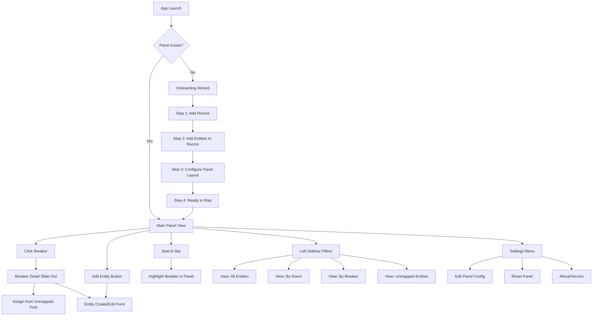
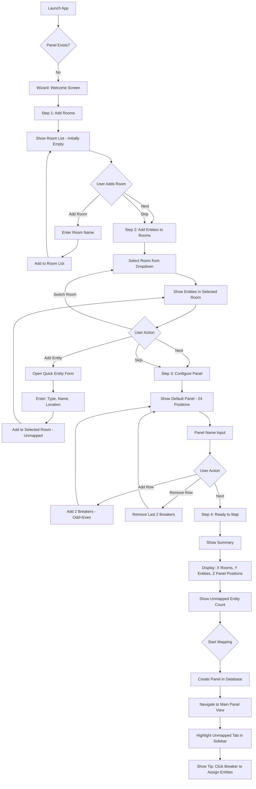
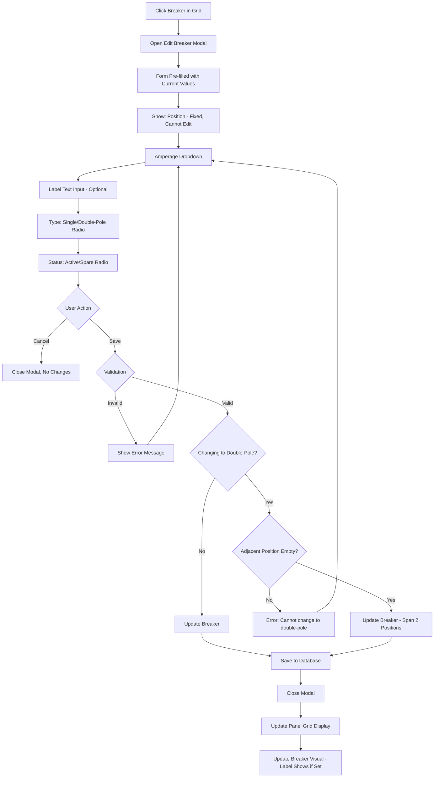
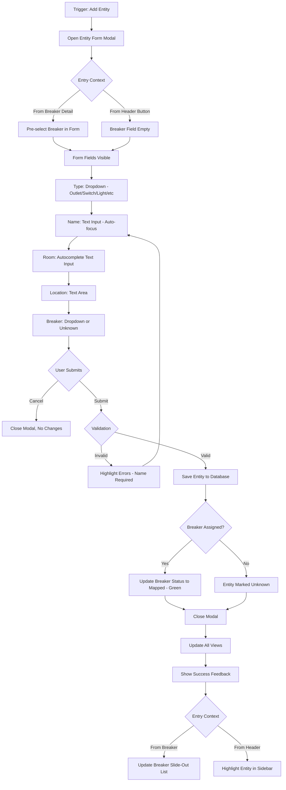
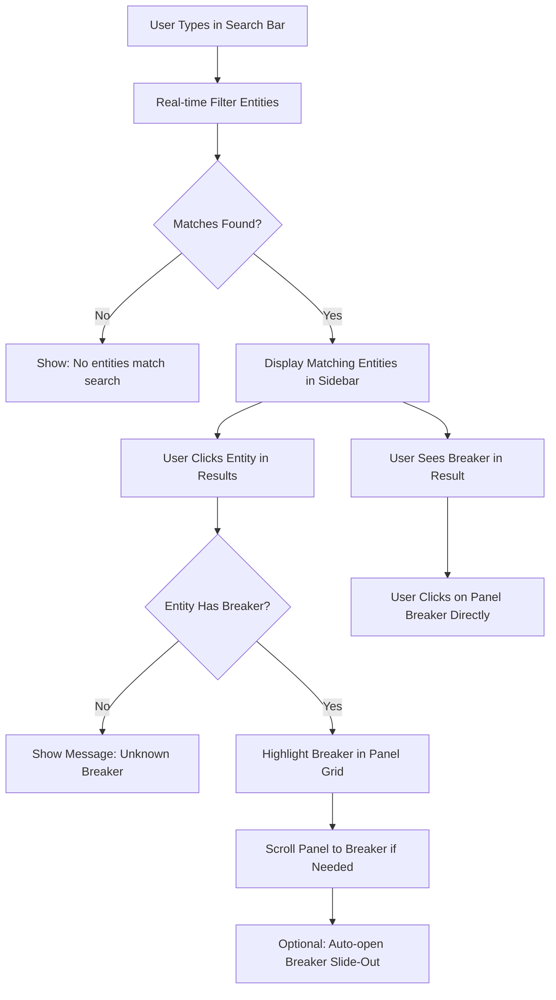
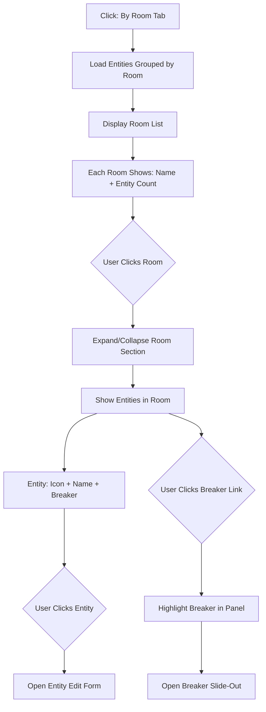

# Map My Panel UI/UX Specification

**Version:** 1.0
**Date:** 2025-10-26
**Author:** Sally (UX Expert) with input from Brendan
**Status:** Draft
**Related Documents:** [PRD](./prd.md) | [Project Brief](./brief.md)

---

## Introduction

This document defines the user experience goals, information architecture, user flows, and visual design specifications for Map My Panel's user interface. It serves as the foundation for visual design and frontend development, ensuring a cohesive and user-centered experience.

The Map My Panel application is a desktop-first Electron app that enables DIY homeowners to visually map and document their electrical breaker panels. This specification prioritizes **clarity and utility over aesthetics**, designing for efficiency and progressive disclosure of complexity.

### Overall UX Goals & Principles

#### Target User Personas

**Primary Persona: DIY Homeowner - "Brendan the Builder"**
- Age: 28-55, owns 1-2 properties
- Technical comfort: Comfortable with desktop software, understands basic electrical concepts
- Performs 2-10 electrical projects per year
- Pain point: Wastes 10-20 minutes per project identifying circuits
- Goal: Build permanent knowledge base about home electrical system
- Behavior: Discovers circuit mappings gradually over time during electrical work

**Secondary Persona: Small Landlord - "Property Manager Pat"**
- Manages 1-5 rental properties
- Needs consistent documentation across multiple panels
- May direct electricians remotely
- Goal: Quick reference when tenants report issues
- Behavior: Documents panels systematically, refers back during maintenance calls

#### Usability Goals

1. **Ease of Learning:** New users can create a panel and add their first entity within 5 minutes of launching the app
2. **Efficiency of Use:** Finding which breaker controls an entity takes under 5 seconds via search
3. **Minimal Data Entry Friction:** Adding a new entity with full details takes under 30 seconds
4. **Error Prevention:** Clear validation and confirmation for destructive actions (delete entity, reset panel)
5. **Memorability:** Users returning after weeks can immediately navigate to entity list or add new entities
6. **Discoverability:** Primary workflows (panel → breaker → entities) are immediately obvious from visual design

#### Design Principles

1. **Clarity over Cleverness** - Prioritize clear communication over aesthetic innovation. Users should never wonder what something does.

2. **Progressive Disclosure** - Show only what's needed, when needed. Start simple (panel grid + basic entities), reveal complexity as users engage (filtering, room organization, stats).

3. **Spatial Consistency** - The breaker panel grid is anchored in the same position across sessions. Room lists and filters maintain their state. Create a sense of place, not ephemeral screens.

4. **Immediate Feedback** - Every action has clear, immediate visual response. Clicking a breaker highlights it and shows slide-out. Search filters update in real-time. Status changes (mapped/unmapped) reflect instantly.

5. **Respect User Mental Models** - The visual panel mirrors physical breaker panels (two columns, odd/even). Filtering by room matches how people think ("all my office outlets"). Don't fight established patterns.

### Change Log

| Date       | Version | Description                          | Author |
|------------|---------|--------------------------------------|--------|
| 2025-10-26 | 1.0     | Initial UI/UX specification created  | Sally  |
| 2025-10-26 | 1.1     | Updated onboarding flow: rooms-first approach, breaker labels, unmapped entity pool | Sally  |

---

## Information Architecture (IA)

### Site Map / Screen Inventory



### Navigation Structure

**Primary Navigation:** Left sidebar with four view mode tabs
- **All Entities** - Flat searchable list of all entities
- **By Room** - Grouped by room with entity counts
- **By Breaker** - Grouped by breaker with entity counts
- **Unmapped** - Entities not yet assigned to any breaker

**Secondary Navigation:**
- Header: Global search bar (always visible)
- Header: "Add Entity" button (always visible)
- Header: Settings icon (top-right)

**Contextual Navigation:**
- Click breaker → Breaker Detail slide-out panel
- Click entity in list → Entity Edit form (modal)
- Breaker detail → "Assign from Unmapped" button (shows unmapped entity selection modal)
- Breaker detail → "Create New Entity" button (creates entity pre-assigned to this breaker)

**No Breadcrumbs Needed:** Single-level navigation, always return to Main Panel View

---

## User Flows

### Flow 1: First-Time Setup (Onboarding Wizard)

**User Goal:** Set up the application by documenting rooms and entities first, then configure the breaker panel for mapping

**Entry Points:** App launch (no existing panel in database)

**Success Criteria:** Rooms defined, entities created in unmapped pool, panel configured, user lands on Main Panel View ready to start mapping entities to breakers

#### Flow Diagram



#### Edge Cases & Error Handling

**Step 1: Add Rooms**
- **No rooms added:** Allow skip - entities can be added without room later
- **Duplicate room name:** Warning "Office already exists. Use different name?"
- **Empty room name:** Validation error - cannot add empty room
- **User goes back from Step 2:** Preserve room list

**Step 2: Add Entities**
- **No entities added:** Allow skip - entities can be added later from main view
- **Switch room with unsaved entity:** No issue - entities save immediately
- **All rooms empty:** Show message "No entities yet. Skip to configure panel or add entities now."
- **User goes back from Step 3:** Preserve all entities

**Step 3: Configure Panel**
- **Remove row with entities assigned:** Warning "Breakers 23-24 have entities. Remove anyway?" (shouldn't happen in onboarding but include guard)
- **Change panel name:** Allow edit at any time
- **Minimum positions:** Cannot go below 2 (one row = positions 1, 2)
- **Maximum positions:** Cap at 100
- **User goes back from Step 4:** Preserve panel configuration

**Step 4: Ready to Map**
- **Database creation fails:** Show error, allow retry
- **User exits wizard before completing:** Prompt "Exit setup? You can restart later from Settings."

**Notes:**
- Wizard creates all rooms and entities as unmapped (breaker_id = null)
- Panel is created with default breakers at each position (20A single-pole)
- User can re-run parts of wizard via Settings → Edit Panel / Edit Rooms
- Onboarding emphasizes the real workflow: document what exists, then map connections

---

### Flow 2: Editing a Breaker

**User Goal:** Edit breaker properties (amperage, type, label) to match my physical panel

**Entry Points:**
- Click existing breaker in panel grid → Edit Breaker
- Right-click breaker → Edit

**Success Criteria:** Breaker updated with correct amperage, type, and optional label

#### Flow Diagram



#### Edge Cases & Error Handling

- **Position field:** Read-only, shown for context but cannot be changed
- **Label field:** Optional, can be empty (shows only position number if empty)
- **Label max length:** 20 characters to prevent overflow in breaker card
- **Changing to double-pole:** Validates adjacent position is empty and not occupied by another double-pole
- **Double-pole breaker on last odd position:** Error - no adjacent even position
- **Custom amperage:** Allow manual text input with validation (must be positive integer)
- **Database save fails:** Rollback, show error, allow retry
- **Breaker has entities and user changes to spare:** Warning "This breaker has X entities. Mark as spare anyway?"

**Notes:**
- Panel comes pre-configured with default single-pole 20A breakers
- Labels are purely visual aids (e.g., "Kitchen", "Living") and don't affect functionality
- Changing status to "Spare" changes visual color to amber but doesn't unassign entities

---

### Flow 3: Creating and Assigning an Entity

**User Goal:** Document an electrical entity (outlet, switch, light) and assign it to a breaker

**Entry Points:**
- Click "Add Entity" button in header
- Click breaker → Breaker Detail → "Add Entity to this Breaker"
- Keyboard shortcut: Cmd/Ctrl+N

**Success Criteria:** Entity created with all details, assigned to breaker, visible in filtered views

#### Flow Diagram



#### Edge Cases & Error Handling

- **Name is empty:** Validation error - Name is required
- **Room autocomplete:** Show previous rooms as user types, allow new room entry
- **Breaker Unknown:** Entity saved but not linked to panel grid (appears in "Unknown" filter)
- **Duplicate name warning:** Optional - "You already have 'Office Outlet 1' in Office room. Continue?"
- **Database save fails:** Show error, maintain form data for retry

**Notes:**
- Auto-focus on Name field for rapid data entry
- Tab-through all fields (Type → Name → Room → Location → Breaker)
- Keyboard shortcut Cmd/Ctrl+S to save, Esc to cancel

---

### Flow 4: Finding Which Breaker Controls an Entity (Search)

**User Goal:** I'm working on "Office Outlet 1" - which breaker controls it?

**Entry Points:** Search bar in header (always visible)

**Success Criteria:** Entity found, corresponding breaker highlighted in panel grid

#### Flow Diagram



#### Edge Cases & Error Handling

- **No matches:** Clear message "No entities match 'xyz'. Try a different search."
- **Multiple matches:** Show all, sorted by relevance (exact name match first, then location match)
- **Entity not assigned to breaker:** Show in results with "Unknown Breaker" badge
- **Breaker off-screen:** Auto-scroll panel grid to make highlighted breaker visible

**Notes:**
- Search is case-insensitive
- Searches across Name, Room, and Location fields
- Clear button (X) appears when search has text
- Results update with <500ms debounce as user types

---

### Flow 5: Viewing Entities by Room

**User Goal:** See all electrical entities in my office so I can document them together

**Entry Points:** Left sidebar → "By Room" tab

**Success Criteria:** Entities grouped by room, expandable/collapsible sections, quick navigation

#### Flow Diagram



#### Edge Cases & Error Handling

- **No room assigned:** Entities without room go to "Uncategorized" section
- **Empty rooms:** If room has no entities (deleted all), hide from list
- **New room created:** Automatically appears in alphabetical order

**Notes:**
- Rooms sorted alphabetically
- Entity count badge next to room name
- Collapse/expand with smooth animation
- Remember expanded state across sessions

---

## Wireframes & Mockups

### Primary Design Files

**Design Tool:** To be created in Figma or directly in code using shadcn/ui components

**Design File Reference:** [Link to Figma when created]

For MVP, detailed visual mockups will be created during implementation using shadcn/ui component library with Tailwind CSS for rapid iteration.

---

### Key Screen Layouts

#### Screen 1: Main Panel View

**Purpose:** Primary interface for visualizing breaker panel, accessing entities, and managing electrical system documentation

**Layout Structure:**
```
┌─────────────────────────────────────────────────────────────────┐
│  Map My Panel    [Search: Find entity...]     [+ Add Entity]  ⚙ │ Header: 64px
├──────────────────┬──────────────────────────────────────────────┤
│  View Mode Tabs  │  Panel Name: Main Panel                      │
│  ┌─────────────┐ │  Quick Stats: 24 entities • 18/24 mapped    │
│  │ All │ Room  │ │                                              │
│  │  Breaker    │ │  ┌─────────────────────────────────┐       │
│  └─────────────┘ │  │   BREAKER PANEL GRID            │       │
│                  │  │                                   │       │
│  Filters:        │  │  ODD (LEFT)    EVEN (RIGHT)      │       │
│  🔍 Search       │  │  ┌──────┐      ┌──────┐         │       │
│  [_________]     │  │  │  1   │      │  2   │         │       │
│                  │  │  │ 15A  │      │ 20A  │         │       │
│  Type:           │  │  │ 🟢   │      │ ⚪   │         │       │
│  ☑ Outlet        │  │  └──────┘      └──────┘         │       │
│  ☑ Switch        │  │  ┌──────┐      ┌──────┐         │       │
│  ☑ Light         │  │  │  3   │      │  4   │         │       │
│  □ Appliance     │  │  │ 20A  │      │ 20A  │         │       │
│  □ Other         │  │  │ 🟢   │      │ 🟡   │         │       │
│                  │  │  └──────┘      └──────┘         │       │
│  Status:         │  │  ┌──────┐      ┌──────┐         │       │
│  ☑ Mapped        │  │  │  5   │      │  6   │         │       │
│  ☑ Unmapped      │  │  │ ...  │      │ ...  │         │       │
│  ☑ Spare         │  │  └──────┘      └──────┘         │       │
│                  │  │                                   │       │
│  [Clear Filters] │  └─────────────────────────────────┘       │
│                  │                                              │
└──────────────────┴──────────────────────────────────────────────┘
   256px sidebar      Main content area (flexible width)
```

**Key Elements:**
- **Header (64px fixed):** App title, global search, Add Entity CTA, settings icon
- **Left Sidebar (256px fixed):** View mode tabs, filters, search within view
- **Main Content (flexible):** Panel name, quick stats, scrollable breaker grid
- **Breaker Cards:** Position number, amperage, status color (green/gray/amber)
- **Grid Layout:** CSS Grid, 2 columns, responsive gap, scrollable if >20 breakers

**Interaction Notes:**
- Hover on breaker: Subtle elevation, cursor pointer, show tooltip "X entities"
- Click breaker: Highlight breaker, open slide-out from right
- Status colors: 🟢 Green (mapped), ⚪ Gray (unmapped), 🟡 Amber (spare)
- Quick stats update in real-time as entities are added/removed

**Design File Reference:** Main-Panel-View.fig

---

#### Screen 2: Onboarding Wizard (4 Steps)

**Purpose:** First-run setup to document rooms and entities before configuring panel

---

**Step 1 of 4: Add Rooms**

**Layout Structure:**
```
┌────────────────────────────────────────┐
│  Welcome to Map My Panel!              │
│  ━━━━━━━━━━━━━━━━━━━━━━━━━━━━━━━━━━  │
│                                         │
│  Step 1 of 4: Add Your Rooms           │
│                                         │
│  Start by listing the rooms in your    │
│  house. This helps organize entities.  │
│                                         │
│  Your Rooms:                            │
│  ┌──────────────────────────────────┐ │
│  │ 📍 Office                    [×] │ │
│  │ 📍 Kitchen                   [×] │ │
│  │ 📍 Master Bedroom            [×] │ │
│  │ 📍 Hallway                   [×] │ │
│  │ 📍 Living Room               [×] │ │
│  └──────────────────────────────────┘ │
│                                         │
│  Add a room:                            │
│  ┌────────────────────────────┐  [+]  │
│  │ [Type room name...]         │ Add   │
│  └────────────────────────────┘       │
│                                         │
│  Tip: You can skip this and add rooms  │
│  later if needed.                       │
│                                         │
│         [Skip]    [Next → (5 rooms)]   │
└────────────────────────────────────────┘
```

---

**Step 2 of 4: Add Entities to Rooms**

```
┌────────────────────────────────────────┐
│  Step 2 of 4: Add Entities to Rooms    │
│                                         │
│  Now add electrical entities (outlets,  │
│  switches, lights) to each room.        │
│                                         │
│  Select Room:                           │
│  ┌────────────────────────────────┐   │
│  │ 📍 Office                    ▼ │   │
│  └────────────────────────────────┘   │
│                                         │
│  Entities in Office: (4)                │
│  ┌──────────────────────────────────┐ │
│  │ 🔌 Outlet 1 - Near window    [×]│ │
│  │ 🔌 Outlet 2 - Behind desk    [×]│ │
│  │ 💡 Ceiling Light             [×]│ │
│  │ 💡 Desk Lamp                 [×]│ │
│  └──────────────────────────────────┘ │
│                                         │
│  [+ Add Entity to Office]               │
│                                         │
│  ┌─ Quick Add Entity ───────────────┐ │
│  │ Type: [Outlet ▼]                 │ │
│  │ Name: [_______________]          │ │
│  │ Location: [_______________]      │ │
│  │          [Cancel] [Add]          │ │
│  └──────────────────────────────────┘ │
│                                         │
│  Total entities: 12  │  Rooms: 1/5     │
│                                         │
│         [← Back]    [Next →]           │
└────────────────────────────────────────┘
```

---

**Step 3 of 4: Configure Panel**

```
┌────────────────────────────────────────┐
│  Step 3 of 4: Configure Breaker Panel  │
│                                         │
│  Panel Name:                            │
│  ┌────────────────────────────────┐   │
│  │ Main Panel                      │   │
│  └────────────────────────────────┘   │
│                                         │
│  Panel Layout: (24 positions)           │
│  ┌───────────────────────────────┐    │
│  │  ODD (Left)    EVEN (Right)   │    │
│  │  ┌──────┐      ┌──────┐       │    │
│  │  │  1   │      │  2   │       │    │
│  │  │ 20A  │      │ 20A  │       │    │
│  │  └──────┘      └──────┘       │    │
│  │  ┌──────┐      ┌──────┐       │    │
│  │  │  3   │      │  4   │       │    │
│  │  │ 20A  │      │ 20A  │       │    │
│  │  └──────┘      └──────┘       │    │
│  │  ... (showing 24 positions)   │    │
│  └───────────────────────────────┘    │
│                                         │
│  [+ Add Row (2 breakers)]               │
│  [- Remove Last Row]                    │
│                                         │
│  Tip: Each row adds 2 breakers (one    │
│  odd, one even). You can edit breaker  │
│  properties later.                      │
│                                         │
│         [← Back]    [Next →]           │
└────────────────────────────────────────┘
```

---

**Step 4 of 4: Ready to Map!**

```
┌────────────────────────────────────────┐
│  Step 4 of 4: Ready to Start Mapping!  │
│                                         │
│  ✓ 5 rooms configured                  │
│  ✓ 12 entities created                 │
│  ✓ 24-position panel ready              │
│                                         │
│  ━━━━━━━━━━━━━━━━━━━━━━━━━━━━━━━━━━  │
│                                         │
│  Next Steps:                            │
│                                         │
│  Your 12 entities are currently         │
│  unmapped (not assigned to breakers).   │
│                                         │
│  To start mapping:                      │
│  1. Click a breaker in the panel        │
│  2. Click "Assign from Unmapped"        │
│  3. Select entities to assign           │
│                                         │
│  As you work on electrical projects,    │
│  you'll discover which breaker          │
│  controls each entity and can map       │
│  them progressively.                    │
│                                         │
│  Unmapped entities: 12                  │
│                                         │
│               [Start Mapping!]          │
└────────────────────────────────────────┘
```

**Key Elements:**
- **Step 1:** Room list with add/remove, can skip
- **Step 2:** Room selector + quick entity form, shows running count
- **Step 3:** Panel name + visual grid with add/remove rows (starts at 24)
- **Step 4:** Summary screen with unmapped count, clear next steps

**Interaction Notes:**
- **Step 1:** Enter adds room to list, X removes room, Skip goes to Step 2
- **Step 2:** Room dropdown changes entity list, quick add inline, can skip
- **Step 3:** Add/Remove row buttons update grid immediately, minimum 2 positions
- **Step 4:** "Start Mapping!" creates panel in database and goes to Main Panel View with Unmapped tab highlighted
- All steps allow Back navigation (preserves data)
- Esc prompts "Exit setup? Progress will be lost."

**Design File Reference:** Onboarding-Wizard.fig

---

#### Screen 3: Breaker Detail Slide-Out Panel

**Purpose:** Show all entities assigned to a specific breaker, assign from unmapped pool, or create new entity

**Layout Structure:**
```
Main Panel View                    Slide-Out Panel (384px)
┌────────────────────┬───────────────────────────────┐
│                    │ ┌───────────────────────────┐ │
│  Breaker Grid      │ │ Breaker 15 - 20A       [X]│ │
│  ┌──────┐          │ │ "Living Room"              │ │
│  │  15  │ ◄────────┼─│ Single-Pole • Active (3)   │ │
│  │ 20A  │ Highlight │ └───────────────────────────┘ │
│  │"Liv" │          │ │                             │ │
│  │ 🟢   │          │ │ Entities on this circuit:   │ │
│  └──────┘          │ │                             │ │
│                    │ │ ┌─────────────────────────┐│ │
│                    │ │ │ 🔌 Living Room Outlet 1 ││ │
│                    │ │ │ Room: Living Room       ││ │
│                    │ │ │ Near couch      [Edit][×]││ │
│                    │ │ └─────────────────────────┘│ │
│                    │ │                             │ │
│                    │ │ ┌─────────────────────────┐│ │
│                    │ │ │ 💡 Living Room Ceiling  ││ │
│                    │ │ │ Room: Living Room       ││ │
│                    │ │ │ Main overhead   [Edit][×]││ │
│                    │ │ └─────────────────────────┘│ │
│                    │ │                             │ │
│                    │ │ ┌─────────────────────────┐│ │
│                    │ │ │ 🔌 Hallway Outlet 1     ││ │
│                    │ │ │ Room: Hallway           ││ │
│                    │ │ │ Under switch    [Edit][×]││ │
│                    │ │ └─────────────────────────┘│ │
│                    │ │                             │ │
│                    │ │ ━━━━━━━━━━━━━━━━━━━━━━━━━ │ │
│                    │ │                             │ │
│                    │ │ Add Entity:                 │ │
│                    │ │ [🔗 Assign from Unmapped]  │ │
│                    │ │ [+ Create New Entity]       │ │
│                    │ │                             │ │
│                    │ │ ━━━━━━━━━━━━━━━━━━━━━━━━━ │ │
│                    │ │                             │ │
│                    │ │ Breaker Actions:            │ │
│                    │ │ [✏️ Edit Breaker]           │ │
│                    │ │ [🔒 Mark as Spare]          │ │
│                    │ └─────────────────────────────┘ │
└────────────────────┴───────────────────────────────┘

When user clicks "Assign from Unmapped":
┌───────────────────────────────┐
│ Assign Entity to Breaker 15   │
│                               │
│ Unmapped Entities (10):       │
│                               │
│ ☐ Office Outlet 1             │
│   Office • Outlet             │
│                               │
│ ☐ Kitchen Counter Outlet      │
│   Kitchen • Outlet            │
│                               │
│ ☐ Bedroom Ceiling Light       │
│   Bedroom • Light             │
│                               │
│ ☐ Hallway Switch              │
│   Hallway • Switch            │
│                               │
│ ... (scrollable list)         │
│                               │
│ [Cancel]  [Assign Selected]   │
└───────────────────────────────┘
```

**Key Elements:**
- **Slide-out from right:** 384px wide, full height
- **Header:** Breaker number, amperage, optional label "Living Room", type, status, entity count
- **Entity Cards:** Icon, name, room, location, Edit/Delete inline actions
- **Add Entity Options:** Assign from Unmapped (shows modal) OR Create New (opens entity form pre-assigned to this breaker)
- **Breaker Actions:** Edit breaker properties, mark as spare
- **Unmapped Modal:** Checkbox list of all unmapped entities, multi-select, confirm to assign

**Interaction Notes:**
- Slides in from right with smooth animation (300ms ease-out)
- Breaker label shows in header if set, otherwise just number and amperage
- Clicking outside or [X] closes slide-out
- Esc key closes slide-out
- Breaker remains highlighted in grid while slide-out is open
- [X] on entity card unassigns entity (moves back to unmapped pool) with confirmation
- "Assign from Unmapped" opens modal overlay on top of slide-out
- User can multi-select entities in unmapped modal
- "Assign Selected" assigns all checked entities to this breaker and closes modal
- "Create New Entity" opens entity form with breaker pre-selected
- Grid card shows truncated label ("Liv" for "Living Room") if label is long

**Design File Reference:** Breaker-Slide-Out.fig

---

#### Screen 4: Entity List/Database View (By Room)

**Purpose:** Browse all entities grouped by room for systematic documentation

**Layout Structure:**
```
Left Sidebar - By Room Tab Active
┌──────────────────────────────────┐
│ View Mode:                       │
│ ┌─────┬──────┬─────────┐        │
│ │ All │ Room │ Breaker │        │
│ └─────┴──────┴─────────┘        │
│         ▲ Active                 │
│                                  │
│ 🔍 Search rooms or entities      │
│ ┌──────────────────────────────┐│
│ │ [search input]                ││
│ └──────────────────────────────┘│
│                                  │
│ 📍 Office (5) ▼                  │
│   🔌 Outlet 1          Br 15     │
│   🔌 Outlet 2          Br 15     │
│   💡 Ceiling Light     Br 17     │
│   🔌 Outlet 3          Br 19     │
│   💡 Desk Lamp         Unknown   │
│                                  │
│ 📍 Kitchen (8) ▼                 │
│   🔌 Counter Outlet 1  Br 3      │
│   🔌 Counter Outlet 2  Br 3      │
│   🔌 Island Outlet     Br 5      │
│   💡 Ceiling Light     Br 7      │
│   💡 Under Cabinet     Br 7      │
│   🔌 Refrigerator      Br 9      │
│   🔌 Microwave         Br 11     │
│   🔌 Dishwasher        Br 13     │
│                                  │
│ 📍 Bedroom (3) ▶                 │
│                                  │
│ 📍 Uncategorized (2) ▼           │
│   🔌 Unknown Outlet    Unknown   │
│   💡 Mystery Light     Br 21     │
│                                  │
└──────────────────────────────────┘
```

**Key Elements:**
- **View tabs:** All | Room | Breaker | Unmapped
- **Search bar:** Filters across all rooms and entities
- **Expandable sections:** Click room to expand/collapse
- **Entity rows:** Icon, name, breaker assignment
- **Uncategorized section:** Entities without room
- **Entity count badges:** (5) next to room name

**Interaction Notes:**
- Click room header to expand/collapse (chevron rotates)
- Click entity row to open Edit Entity form
- Click breaker link (Br 15) to highlight in panel grid
- Drag-drop entities between rooms (future enhancement)
- Right-click entity for context menu (Edit, Delete, Reassign)

**Design File Reference:** Entity-List-Room-View.fig

---

#### Screen 4b: Entity List - Unmapped View

**Purpose:** Show all entities not yet assigned to any breaker for easy mapping

**Layout Structure:**
```
Left Sidebar - Unmapped Tab Active
┌──────────────────────────────────┐
│ View Mode:                       │
│ ┌─────┬──────┬─────────┬────────┐
│ │ All │ Room │ Breaker │Unmapped│
│ └─────┴──────┴─────────┴────────┘
│                         ▲ Active  │
│                                  │
│ 🔍 Search unmapped entities      │
│ ┌──────────────────────────────┐│
│ │ [search input]                ││
│ └──────────────────────────────┘│
│                                  │
│ Unmapped Entities (10)           │
│ ━━━━━━━━━━━━━━━━━━━━━━━━━━━━━ │
│                                  │
│ 🔌 Office Outlet 3               │
│    Office • Near door            │
│    [Assign to Breaker ▼]         │
│                                  │
│ 💡 Bedroom Ceiling Light         │
│    Bedroom • Main overhead       │
│    [Assign to Breaker ▼]         │
│                                  │
│ 🔌 Kitchen Counter Outlet        │
│    Kitchen • By sink             │
│    [Assign to Breaker ▼]         │
│                                  │
│ 💡 Hallway Switch                │
│    Hallway • Near bathroom       │
│    [Assign to Breaker ▼]         │
│                                  │
│ 🔌 Unknown Outlet                │
│    (No room) • Unknown location  │
│    [Assign to Breaker ▼]         │
│                                  │
│ ... (scrollable list)            │
│                                  │
│ ━━━━━━━━━━━━━━━━━━━━━━━━━━━━━ │
│                                  │
│ Tip: Click a breaker in the      │
│ panel to assign multiple         │
│ entities at once.                │
│                                  │
└──────────────────────────────────┘
```

**Key Elements:**
- **Unmapped count:** Shows total unmapped entities in header
- **Entity cards:** Show icon, name, room (if set), location
- **Quick assign dropdown:** Each entity has dropdown to select breaker
- **Empty state:** If no unmapped entities, show "All entities mapped! 🎉"
- **Helpful tip:** Guide users to use panel-first workflow

**Interaction Notes:**
- Dropdown shows all breakers (1-24) with amperage
- Selecting breaker immediately assigns entity and removes from unmapped list
- Click entity card to edit entity details
- Badge shows unmapped count in tab: "Unmapped (10)"
- This view is highlighted after onboarding completes

**Design File Reference:** Entity-List-Unmapped-View.fig

---

#### Screen 5: Entity Create/Edit Form

**Purpose:** Add new entity or edit existing entity details

**Layout Structure:**
```
Modal (centered, 480px width)
┌────────────────────────────────────┐
│  Add Entity to Breaker 15      [X] │
├────────────────────────────────────┤
│                                    │
│  Entity Type *                     │
│  ┌──────────────────────────────┐ │
│  │ 🔌 Outlet            ▼      │ │ Dropdown
│  └──────────────────────────────┘ │
│                                    │
│  Name *                            │
│  ┌──────────────────────────────┐ │
│  │ Office Outlet 1  [autofocus] │ │ Text input
│  └──────────────────────────────┘ │
│                                    │
│  Room                              │
│  ┌──────────────────────────────┐ │
│  │ Office              ▼        │ │ Autocomplete
│  └──────────────────────────────┘ │
│  Suggestions: Office, Kitchen     │
│                                    │
│  Location / Description            │
│  ┌──────────────────────────────┐ │
│  │ Near outside water faucet    │ │ Textarea
│  │ spigot on north wall         │ │
│  │                               │ │
│  └──────────────────────────────┘ │
│                                    │
│  Breaker                           │
│  ┌──────────────────────────────┐ │
│  │ Breaker 15 - 20A     ▼      │ │ Dropdown
│  └──────────────────────────────┘ │
│  or [ ] Unknown Breaker           │
│                                    │
│  * Required fields                 │
│                                    │
│     [Cancel]      [Save Entity]   │
│                                    │
└────────────────────────────────────┘
```

**Key Elements:**
- **Modal overlay:** Centered, 480px width, semi-transparent backdrop
- **Form fields:** Type (dropdown), Name (text), Room (autocomplete), Location (textarea), Breaker (dropdown)
- **Validation:** Name required, others optional
- **Autocomplete for Room:** Shows previously used rooms, allows new entry
- **Breaker dropdown:** Lists all configured breakers, plus "Unknown" option

**Interaction Notes:**
- Auto-focus on Name field when modal opens
- Tab through fields: Type → Name → Room → Location → Breaker → Save
- Enter key submits form if validation passes
- Esc or Cancel closes modal without saving
- Room autocomplete shows dropdown on focus with previous rooms
- Typing new room name adds it to autocomplete for future use
- Save button disabled until Name is filled
- Validation errors appear inline below fields

**Design File Reference:** Entity-Form.fig

---

#### Screen 6: Settings/Preferences Screen

**Purpose:** Manage panel configuration, reset database, view app information

**Layout Structure:**
```
┌────────────────────────────────────────┐
│  Settings                          [X] │
├────────────────────────────────────────┤
│                                        │
│  Panel Configuration                   │
│  ┌──────────────────────────────────┐ │
│  │ Panel Name: Main Panel           │ │
│  │ Positions: 24                    │ │
│  │ Created: Oct 26, 2025            │ │
│  │                                  │ │
│  │ [Edit Panel Configuration]       │ │
│  └──────────────────────────────────┘ │
│                                        │
│  Data Management                       │
│  ┌──────────────────────────────────┐ │
│  │ Total Entities: 24               │ │
│  │ Total Breakers: 18               │ │
│  │ Database Size: 128 KB            │ │
│  │                                  │ │
│  │ [Export Data] (Coming Soon)      │ │
│  │ [Import Data] (Coming Soon)      │ │
│  └──────────────────────────────────┘ │
│                                        │
│  Danger Zone                           │
│  ┌──────────────────────────────────┐ │
│  │ ⚠️  Reset Panel                   │ │
│  │                                  │ │
│  │ This will permanently delete all │ │
│  │ breakers and entities. This      │ │
│  │ action cannot be undone.         │ │
│  │                                  │ │
│  │ [Reset Panel...]                 │ │
│  └──────────────────────────────────┘ │
│                                        │
│  About                                 │
│  ┌──────────────────────────────────┐ │
│  │ Map My Panel v1.0.0              │ │
│  │ Built with Electron + React      │ │
│  │                                  │ │
│  │ [View Licenses]                  │ │
│  │ [Check for Updates] (Future)     │ │
│  └──────────────────────────────────┘ │
│                                        │
│                     [Close]            │
│                                        │
└────────────────────────────────────────┘
```

**Key Elements:**
- **Panel Configuration:** View current settings, edit option
- **Data Management:** Stats, future export/import
- **Danger Zone:** Reset panel with clear warning
- **About:** Version info, licenses

**Interaction Notes:**
- Settings accessed via gear icon in header
- Edit Panel opens wizard in edit mode
- Reset Panel requires multi-step confirmation (type "DELETE")
- Export/Import greyed out with "Coming Soon" tooltip

**Design File Reference:** Settings.fig

---

## Component Library / Design System

### Design System Approach

**Selected Framework:** **shadcn/ui** with Tailwind CSS

**Rationale:**
- shadcn/ui provides accessible, unstyled Radix UI primitives
- Components are copied into codebase (full control, no package dependency)
- Tailwind CSS enables rapid styling iteration
- Tree-shakeable for smaller bundle sizes
- TypeScript-first with excellent type safety
- Active community and comprehensive documentation

**Component Source:** https://ui.shadcn.com/

**Installation Approach:**
```bash
npx shadcn-ui@latest init
npx shadcn-ui@latest add button
npx shadcn-ui@latest add input
npx shadcn-ui@latest add dialog
# etc.
```

---

### Core Components

#### Component: Button

**Purpose:** Primary call-to-action and secondary actions throughout the application

**Variants:**
- `default` - Primary CTA (Add Entity, Save, Create)
- `secondary` - Secondary actions (Cancel, Edit)
- `outline` - Tertiary actions (filters, toggles)
- `destructive` - Dangerous actions (Delete, Reset)
- `ghost` - Minimal actions (close, dismiss)
- `link` - Text-only links

**States:**
- `default` - Normal state
- `hover` - Elevated, slight color shift
- `active` - Pressed state
- `disabled` - Greyed out, not interactive
- `loading` - Spinner, disabled interaction

**Usage Guidelines:**
- Use `default` for primary action per screen (max 1)
- Use `destructive` for irreversible actions (delete, reset)
- Use `ghost` for icon-only buttons (close, settings)
- Always include aria-label for icon-only buttons
- Maintain minimum touch target of 44x44px

**Example:**
```tsx
<Button variant="default">Add Entity</Button>
<Button variant="destructive">Delete Entity</Button>
<Button variant="ghost" size="icon"><X /></Button>
```

---

#### Component: Input / Textarea

**Purpose:** Text entry for entity names, locations, search queries

**Variants:**
- `default` - Standard text input
- `search` - With search icon prefix
- `error` - Red border, error state
- `disabled` - Greyed out, read-only

**States:**
- `default` - Empty or filled
- `focus` - Blue ring outline (accessibility)
- `error` - Red border + error message below
- `disabled` - Greyed, not editable

**Usage Guidelines:**
- Always pair with `<Label>` for accessibility
- Use `placeholder` for examples, not instructions
- Show validation errors inline below input
- Auto-focus on first input in forms
- Support Tab navigation between fields

**Example:**
```tsx
<Label htmlFor="entity-name">Name *</Label>
<Input
  id="entity-name"
  placeholder="e.g., Office Outlet 1"
  autoFocus
/>
```

---

#### Component: Select / Dropdown

**Purpose:** Entity type, breaker selection, room selection (with autocomplete)

**Variants:**
- `default` - Standard dropdown
- `searchable` - With search/filter capability
- `multi-select` - Multiple selections (future)

**States:**
- `closed` - Collapsed, showing current selection
- `open` - Expanded options list
- `disabled` - Greyed, not interactive

**Usage Guidelines:**
- Use for 3+ options (use radio buttons for 2)
- Show current selection in trigger
- Support keyboard navigation (arrows, enter, escape)
- For Room field: Use Combobox variant for autocomplete
- Sort options logically (breakers by number, types alphabetically)

**Example:**
```tsx
<Select>
  <SelectTrigger>
    <SelectValue placeholder="Select breaker" />
  </SelectTrigger>
  <SelectContent>
    <SelectItem value="15">Breaker 15 - 20A</SelectItem>
    <SelectItem value="17">Breaker 17 - 15A</SelectItem>
  </SelectContent>
</Select>
```

---

#### Component: Dialog / Modal

**Purpose:** Entity forms, confirmations, warnings

**Variants:**
- `default` - Centered modal
- `alert` - Alert dialogs (confirmations)
- `drawer` - Slide-out panels (not modal variant, use Sheet)

**States:**
- `closed` - Not visible
- `open` - Visible with backdrop

**Usage Guidelines:**
- Use sparingly - prefer inline editing when possible
- Always provide close button [X] in top-right
- Support Esc key to close
- Trap focus within modal while open
- Use for: entity forms, confirmations, wizards
- Avoid for: breaker details (use Sheet/slide-out)

**Example:**
```tsx
<Dialog open={isOpen} onOpenChange={setIsOpen}>
  <DialogContent>
    <DialogHeader>
      <DialogTitle>Add Entity</DialogTitle>
    </DialogHeader>
    {/* Form content */}
  </DialogContent>
</Dialog>
```

---

#### Component: Sheet (Slide-Out Panel)

**Purpose:** Breaker detail panel, extended content without leaving context

**Variants:**
- `right` - Slides from right (default for breaker detail)
- `left` - Slides from left
- `top` / `bottom` - Slides from top/bottom

**States:**
- `closed` - Hidden off-screen
- `open` - Visible, slides into view

**Usage Guidelines:**
- Use for contextual content that enhances main view
- Preferred over modal when context should remain visible
- Breaker detail slides from right (384px width)
- Support Esc key and click-outside to close
- Smooth animation (300ms ease-out)

**Example:**
```tsx
<Sheet open={selectedBreaker !== null}>
  <SheetContent side="right">
    <SheetHeader>
      <SheetTitle>Breaker {selectedBreaker?.position}</SheetTitle>
    </SheetHeader>
    {/* Breaker entities list */}
  </SheetContent>
</Sheet>
```

---

#### Component: Card

**Purpose:** Breaker grid items, entity cards, room sections

**Variants:**
- `default` - Standard card
- `interactive` - Hover effects, clickable
- `status` - With status color (green/gray/amber)

**States:**
- `default` - Normal
- `hover` - Elevated shadow, cursor pointer
- `active` - Pressed/selected
- `disabled` - Greyed, not interactive

**Usage Guidelines:**
- Use for breaker grid items (clickable cards)
- Use for entity items in lists
- Apply status colors via border or background
- Ensure sufficient contrast for text on colored backgrounds
- Minimum size: 80x80px for breakers

**Example:**
```tsx
<Card
  className={cn(
    "cursor-pointer transition-all hover:shadow-md",
    isMapped && "border-green-500"
  )}
  onClick={() => handleBreakerClick(breaker)}
>
  <CardContent>
    <div className="text-2xl font-bold">{breaker.position}</div>
    <div className="text-sm">{breaker.amperage}A</div>
  </CardContent>
</Card>
```

---

#### Component: Badge

**Purpose:** Status indicators, counts, labels

**Variants:**
- `default` - Neutral grey
- `success` - Green (mapped)
- `warning` - Amber (spare)
- `error` - Red (issues)
- `secondary` - Muted (counts)

**States:**
- `static` - Display only

**Usage Guidelines:**
- Use for entity type icons (🔌 Outlet badge)
- Use for counts (Room: Office (5))
- Use for status (Mapped, Unknown Breaker)
- Keep text short (1-2 words max)

**Example:**
```tsx
<Badge variant="success">Mapped</Badge>
<Badge variant="secondary">5 entities</Badge>
```

---

#### Component: Tabs

**Purpose:** View mode switching (All, By Room, By Breaker)

**Variants:**
- `default` - Standard tabs
- `pills` - Pill-style tabs

**States:**
- `active` - Current tab
- `inactive` - Other tabs
- `hover` - Hovering non-active tab

**Usage Guidelines:**
- Use for view mode switching in sidebar
- Maintain tab state in URL or local storage
- Support keyboard navigation (left/right arrows)
- Show active state clearly (underline or background)

**Example:**
```tsx
<Tabs value={viewMode} onValueChange={setViewMode}>
  <TabsList>
    <TabsTrigger value="all">All</TabsTrigger>
    <TabsTrigger value="room">Room</TabsTrigger>
    <TabsTrigger value="breaker">Breaker</TabsTrigger>
  </TabsList>
</Tabs>
```

---

#### Component: Accordion

**Purpose:** Collapsible room sections in By Room view

**Variants:**
- `default` - Single expand
- `multiple` - Multiple expanded sections

**States:**
- `collapsed` - Chevron right
- `expanded` - Chevron down

**Usage Guidelines:**
- Use for room groupings in sidebar
- Allow multiple rooms expanded simultaneously
- Smooth expand/collapse animation (200ms)
- Remember expanded state across sessions
- Chevron indicates expand/collapse direction

**Example:**
```tsx
<Accordion type="multiple">
  <AccordionItem value="office">
    <AccordionTrigger>
      📍 Office (5)
    </AccordionTrigger>
    <AccordionContent>
      {/* Entity list */}
    </AccordionContent>
  </AccordionItem>
</Accordion>
```

---

## Branding & Style Guide

### Visual Identity

**Brand Guidelines:** Not applicable - personal utility tool with no formal branding

**Design Philosophy:** Utilitarian, professional, clarity-focused

**Visual References:**
- VS Code (clean, functional developer tool)
- Linear (minimal, efficient project management)
- Notion (progressive disclosure, clear hierarchy)

---

### Color Palette

| Color Type | Hex Code | Usage |
|------------|----------|-------|
| **Primary** | `#3b82f6` (Blue-500) | Interactive elements, links, focused states |
| **Secondary** | `#64748b` (Slate-500) | Secondary text, borders, dividers |
| **Success / Mapped** | `#10b981` (Emerald-500) | Mapped breakers (has entities assigned) |
| **Warning / Spare** | `#f59e0b` (Amber-500) | Spare/unused breakers |
| **Error / Destructive** | `#ef4444` (Red-500) | Errors, destructive actions, delete buttons |
| **Unmapped** | `#e2e8f0` (Slate-200) | Unmapped breakers (no entities), disabled states |
| **Neutral / Text** | `#0f172a` (Slate-900) | Primary text |
| **Neutral / Muted** | `#64748b` (Slate-500) | Secondary text, placeholders |
| **Background** | `#ffffff` (White) | Main background |
| **Background / Muted** | `#f8fafc` (Slate-50) | Sidebar, cards, alternate rows |

**Rationale:** Using Tailwind's Slate color scale for neutrals provides excellent contrast ratios and professional appearance. Status colors (green, amber, red) are highly distinguishable for breaker states.

---

### Typography

#### Font Families

- **Primary (UI):** `Inter` (web font from Google Fonts, fallback to system fonts)
  - Backup: `-apple-system, BlinkMacSystemFont, "Segoe UI", Roboto, sans-serif`
- **Monospace (Numbers, Data):** `"JetBrains Mono"` (for breaker numbers, amperage)
  - Backup: `"SF Mono", Monaco, "Cascadia Code", monospace`

**Rationale:** Inter is highly readable at all sizes and free to use. JetBrains Mono for numbers ensures clear distinction (1 vs I, 0 vs O).

#### Type Scale

| Element | Size | Weight | Line Height | Usage |
|---------|------|--------|-------------|-------|
| **H1** | 32px (2rem) | 700 (Bold) | 1.2 | Page titles (rare in MVP) |
| **H2** | 24px (1.5rem) | 600 (Semibold) | 1.3 | Section headers (Panel Name, Modal Titles) |
| **H3** | 20px (1.25rem) | 600 (Semibold) | 1.4 | Subsection headers (Entity Type in lists) |
| **Body** | 16px (1rem) | 400 (Regular) | 1.6 | Primary text, entity names, descriptions |
| **Small** | 14px (0.875rem) | 400 (Regular) | 1.5 | Secondary text, metadata, timestamps |
| **Tiny** | 12px (0.75rem) | 500 (Medium) | 1.4 | Labels, badges, helper text |

**Rationale:** 16px body text ensures readability. 1.6 line height improves scanability of entity lists.

---

### Iconography

**Icon Library:** **Lucide React** (https://lucide.dev/)

**Usage Guidelines:**
- 24x24px for header icons (search, settings, add)
- 20x20px for entity type icons (outlet, switch, light)
- 16x16px for inline icons (chevrons, close buttons)
- Stroke width: 2px (default)
- Color: Inherit from parent text color for consistency

**Key Icons:**
- `Outlet` → `Zap` or `Plug` icon
- `Switch` → `ToggleLeft` icon
- `Light` → `Lightbulb` icon
- `Search` → `Search` icon
- `Add Entity` → `Plus` or `PlusCircle` icon
- `Settings` → `Settings` icon
- `Close` → `X` icon
- `Expand/Collapse` → `ChevronRight` / `ChevronDown`
- `Edit` → `Pencil` icon
- `Delete` → `Trash2` icon

**Rationale:** Lucide provides clean, consistent icons with excellent React integration and tree-shaking support.

---

### Spacing & Layout

**Grid System:** CSS Grid for breaker panel, Flexbox for sidebar and forms

**Spacing Scale:** Tailwind default spacing scale (4px increments)
- `1` = 4px (tight spacing within components)
- `2` = 8px (component padding, small gaps)
- `4` = 16px (standard padding, gap between cards)
- `6` = 24px (section spacing)
- `8` = 32px (large section spacing)
- `12` = 48px (screen padding)

**Layout Measurements:**
- **Sidebar width:** 256px (fixed)
- **Slide-out panel width:** 384px (fixed)
- **Modal max-width:** 480px (centered)
- **Breaker card size:** Min 80x80px, max 120x120px (responsive)
- **Header height:** 64px (fixed)
- **Grid gap:** 16px (between breaker cards)

**Rationale:** Fixed sidebar and header provide stable spatial reference. Responsive breaker cards adapt to different screen sizes while maintaining legibility.

---

## Accessibility Requirements

### Compliance Target

**Standard:** None (explicitly deferred for MVP)

**Future Target:** WCAG 2.1 Level AA for post-MVP iterations

**Rationale:** As a personal-use desktop application with solo developer constraint and 4-6 week timeline, accessibility compliance is out of scope for MVP. However, using shadcn/ui provides accessible foundations (keyboard navigation, ARIA attributes, focus management) that will ease future compliance efforts.

---

### Key Requirements (Best Effort for MVP)

**Visual:**
- Color contrast ratios: Aim for 4.5:1 for text (use Tailwind's Slate-900 on White)
- Focus indicators: Blue ring on all interactive elements (Tailwind's `ring-2 ring-blue-500`)
- Text sizing: Minimum 14px, prefer 16px for body text

**Interaction:**
- Keyboard navigation: All actions accessible via Tab, Enter, Esc, Arrow keys
- Screen reader support: Use semantic HTML, ARIA labels on icon-only buttons
- Touch targets: Minimum 44x44px for all clickable elements (shadcn/ui default)

**Content:**
- Alternative text: Not applicable (no images beyond icons)
- Heading structure: Use semantic h1, h2, h3 hierarchy
- Form labels: All inputs paired with `<label>` elements

### Testing Strategy

**MVP:** Manual keyboard testing (Tab through all workflows, no mouse usage)

**Post-MVP:** Automated accessibility testing with axe-core, manual screen reader testing (NVDA on Windows, VoiceOver on macOS)

---

## Responsiveness Strategy

### Breakpoints

| Breakpoint | Min Width | Max Width | Target Devices | Notes |
|------------|-----------|-----------|----------------|-------|
| **Desktop** | 1024px | - | Desktop monitors, laptops | Primary target, optimized for 1440p+ |
| **Tablet** | 768px | 1023px | N/A | Out of scope for MVP |
| **Mobile** | - | 767px | N/A | Out of scope for MVP (defer to Phase 2 PWA) |

**Rationale:** Desktop-first application. Minimum window size 1024x768 ensures sidebar + panel grid are both visible without cramping.

---

### Adaptation Patterns

**Layout Changes:**
- **1440px+:** Ideal layout, all elements comfortably spaced
- **1024-1439px:** Slight reduction in breaker card size, tighter grid gap
- **Below 1024px:** Warn user that optimal experience is 1024px+ (no responsive changes for MVP)

**Navigation Changes:**
- None - fixed sidebar remains visible at all supported sizes

**Content Priority:**
- Breaker grid is always primary focus (central, largest element)
- Sidebar may overlay on very small screens (future enhancement)

**Interaction Changes:**
- None - mouse and keyboard interactions remain consistent

---

## Animation & Micro-interactions

### Motion Principles

**Subtle, Functional Motion:**
- Animations serve functional purpose (communicate state change, guide attention)
- Fast timing (150-300ms) to feel responsive, not sluggish
- Ease-out easing for natural deceleration
- Respect `prefers-reduced-motion` for accessibility (disable animations if set)

**Animation Guidelines:**
- **Use:** Slide-outs, modals, expand/collapse, hover states
- **Avoid:** Gratuitous effects, long durations, complex keyframes

---

### Key Animations

- **Modal Open/Close:** Fade in backdrop (150ms) + scale content from 95% to 100% (200ms), Easing: ease-out
- **Slide-Out Panel:** Translate from right edge (300ms), Easing: cubic-bezier(0.16, 1, 0.3, 1) (smooth slide)
- **Accordion Expand/Collapse:** Height transition (200ms), Easing: ease-out
- **Button Hover:** Scale to 102% + shadow increase (150ms), Easing: ease-out
- **Breaker Highlight:** Background color fade (200ms), Easing: ease-in-out
- **Search Results Update:** Fade out old results (100ms), fade in new (150ms with 50ms delay), Easing: ease-out
- **Entity Card Hover:** Translate Y -2px + shadow increase (150ms), Easing: ease-out

**Respect User Preference:**
```css
@media (prefers-reduced-motion: reduce) {
  * {
    animation-duration: 0.01ms !important;
    transition-duration: 0.01ms !important;
  }
}
```

---

## Performance Considerations

### Performance Goals

- **App Launch:** <3 seconds from click to usable Main Panel View
- **Search Response:** <500ms from keystroke to results update (with debounce)
- **Breaker Click:** <50ms to open slide-out panel
- **Entity Create:** <100ms from Save click to UI update
- **Animation FPS:** Maintain 60fps for all transitions and scrolling

### Design Strategies

**Optimize Rendering:**
- Virtualize long entity lists (100+ items) using `react-window` or `@tanstack/react-virtual`
- Memoize breaker cards with `React.memo` to prevent unnecessary re-renders
- Debounce search input (300ms) to avoid excessive filtering

**Optimize Assets:**
- Use SVG icons (Lucide) for scalability and small file size
- Limit web fonts to 2 weights (Regular 400, Semibold 600) for Inter
- Use Tailwind's purge to eliminate unused CSS

**Optimize Database Queries:**
- Index SQLite columns: `breaker_id`, `entity_type`, `name`, `room`
- Batch read operations (load all entities once, filter in memory)
- Avoid N+1 queries (fetch breakers with entity counts in single query)

**Optimize Animations:**
- Use `transform` and `opacity` for animations (GPU-accelerated)
- Avoid animating `width`, `height`, `top`, `left` (causes layout reflow)
- Use `will-change` sparingly for elements with frequent transforms

---

## Next Steps

### Immediate Actions

1. **Review this specification with Brendan** - Confirm UX approach, visual direction, and component selections align with vision
2. **Create Figma wireframes** (optional) - If visual mockups are desired before implementation
3. **Hand off to Design Architect** - Architect reviews this spec + PRD to design component architecture and state management
4. **Begin shadcn/ui setup** - Initialize Tailwind and install base components (button, input, dialog, sheet, card, tabs, accordion)
5. **Design data flow** - Architect defines how React components communicate with Electron IPC and SQLite
6. **Define component hierarchy** - Architect maps screens to component tree (MainView → Sidebar → BreakerGrid → etc.)

### Design Handoff Checklist

- [x] All user flows documented
- [x] Component inventory complete
- [x] Accessibility requirements defined (deferred to post-MVP, foundations in place)
- [x] Responsive strategy clear (desktop-first, 1024px minimum)
- [x] Brand guidelines incorporated (utilitarian aesthetic, color palette, typography)
- [x] Performance goals established (<3s launch, <500ms search, 60fps)

---

## Updates to PRD

### Critical Addition 1: Room Field for Entities

**Issue:** PRD defined entity fields as Type, Name, Location, Breaker. Missing high-level grouping.

**Solution:** Add **Room** field to entity data model.

**Updated Entity Schema:**
```typescript
interface Entity {
  id: string;
  panel_id: string;
  breaker_id: string | null; // null = unmapped (not assigned to breaker)
  entity_type: 'outlet' | 'switch' | 'light' | 'appliance' | 'hvac' | 'other';
  name: string; // Required: "Office Outlet 1"
  room: string | null; // Optional: "Office" (autocomplete from previous entries)
  location: string | null; // Optional: "Near outside water faucet spigot"
  metadata: object; // JSON for future extensibility
  created_at: Date;
  updated_at: Date;
}
```

**Impact on Requirements:**
- **FR7 Update:** Entity creation includes Room field (autocomplete text input)
- **FR10 Update:** Search includes Room field in addition to Name and Location
- **FR11 Update:** Filter by Room in addition to Type and Breaker
- **New FR21:** Users shall be able to group and view entities by Room in the sidebar "By Room" view
- **New FR22:** Users shall be able to view all unmapped entities (breaker_id = null) in the "Unmapped" tab
- **New FR23:** Users shall be able to assign unmapped entities to breakers from the Breaker Detail slide-out panel

**Architect Action Required:** Update SQLite schema in Story 1.2 to include `room` column in `entities` table.

---

### Critical Addition 2: Label Field for Breakers

**Issue:** Breaker cards only show position number and amperage. Users need quick visual cues for breaker purpose.

**Solution:** Add optional **Label** field to breaker data model.

**Updated Breaker Schema:**
```typescript
interface Breaker {
  id: string;
  panel_id: string;
  position: number; // 1-100, fixed after creation
  breaker_type: 'single-pole' | 'double-pole';
  amperage: number; // 15, 20, 30, 40, 50, etc.
  label: string | null; // Optional: "Kitchen", "Living Room", "Garage" (max 20 chars)
  status: 'active' | 'spare'; // Active = in use, Spare = unused/future
  created_at: Date;
  updated_at: Date;
}
```

**Impact on Requirements:**
- **FR3 Update:** Breaker creation/editing includes optional Label field (text input, max 20 characters)
- **FR5 Update:** Visual panel shows breaker label (truncated if needed) below position number
- **New FR24:** Breaker labels are displayed in breaker cards and slide-out panel header
- **New FR25:** Breaker labels are optional and can be left empty (show only position number if no label)

**UI Impact:**
- Breaker card shows: Position number (large), Amperage, Label (small text if set), Status color
- Breaker Detail slide-out header shows: "Breaker 15 - 20A" with label "Living Room" on second line
- Label field is optional in Edit Breaker form

**Architect Action Required:** Update SQLite schema in Story 1.2 to include `label` column in `breakers` table (nullable varchar(20)).

---

### Critical Addition 3: Rooms-First Onboarding Flow

**Issue:** Original PRD assumed panel-first setup (configure panel, then add entities). Real workflow is document-first (list what exists, then map connections).

**Solution:** Redesign onboarding wizard to match real-world workflow.

**New 4-Step Onboarding Wizard:**
1. **Step 1: Add Rooms** - List all rooms in house (optional, can skip)
2. **Step 2: Add Entities to Rooms** - Document outlets, switches, lights by room (creates unmapped pool)
3. **Step 3: Configure Panel** - Set panel name, adjust layout (starts with default 24 positions, add/remove rows)
4. **Step 4: Ready to Map** - Summary screen, guides user to start assigning unmapped entities to breakers

**Impact on Requirements:**
- **Update Story 1.4:** Onboarding wizard now has 4 steps instead of 3
- **Update Story 2.1:** Panel configuration includes add/remove row functionality
- **New Story Needed:** Room management during onboarding
- **New Story Needed:** Entity creation during onboarding (creates unmapped entities)
- **Panel defaults:** Create panel with all positions pre-configured (single-pole 20A) instead of empty

**UI Flow Impact:**
- After onboarding, user lands on Main Panel View with Unmapped tab highlighted
- Quick stats show "X unmapped entities" to encourage mapping
- Breaker click shows "Assign from Unmapped" button with badge showing unmapped count

**Architect Action Required:** Update Epic 1 and Epic 2 stories to reflect new onboarding flow and panel defaults.

---

*UI/UX Specification created using BMAD-METHOD™ UX framework - User Experience Design & Front-End Planning*
